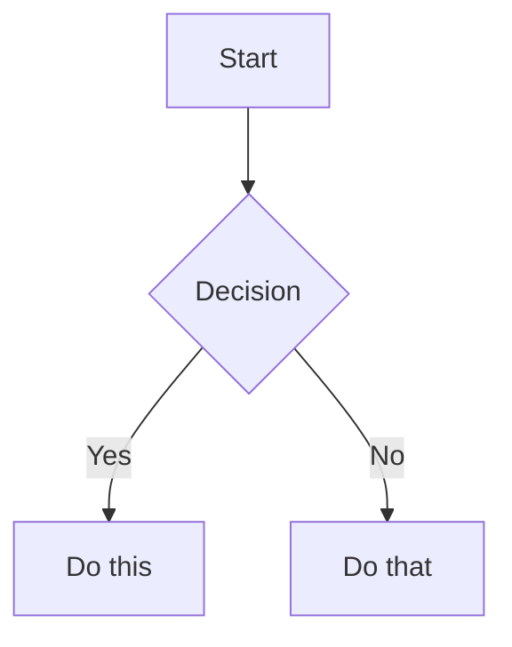

# Cron Job: Content Pipeline — Monday Horizon Review

**Job ID:** 061e346ad4a6
**Run Time:** 2026-06-08 08:02:53
**Schedule:** 0 8 * * 1

## Prompt

[IMPORTANT: The user has invoked the "obsidian" skill, indicating they want you to follow its instructions. The full skill content is loaded below.]

---
name: obsidian
description: Read, search, create, and edit notes in the Obsidian vault.
platforms: [linux, macos, windows]
---

# Obsidian Vault

Use this skill for filesystem-first Obsidian vault work: reading notes, listing notes, searching note files, creating notes, appending content, and adding wikilinks.

## Vault path

Use a known or resolved vault path before calling file tools.

The documented vault-path convention is the `OBSIDIAN_VAULT_PATH` environment variable, for example from `~/.hermes/.env`. If it is unset, use `~/Documents/Obsidian Vault`.

File tools do not expand shell variables. Do not pass paths containing `$OBSIDIAN_VAULT_PATH` to `read_file`, `write_file`, `patch`, or `search_files`; resolve the vault path first and pass a concrete absolute path. Vault paths may contain spaces, which is another reason to prefer file tools over shell commands.

If the vault path is unknown, `terminal` is acceptable for resolving `OBSIDIAN_VAULT_PATH` or checking whether the fallback path exists. Once the path is known, switch back to file tools.

## Installing Obsidian agent skill packs

When the user asks to install or configure Obsidian skills for Hermes from an external repo, use Hermes' skill tap/install commands rather than manually copying folders. For `kepano/obsidian-skills`, install the class-level skills that match common Obsidian work (`obsidian-cli`, `obsidian-markdown`, `obsidian-bases`, `json-canvas`) and configure the target vault path in `~/.hermes/.env` as `OBSIDIAN_VAULT_PATH="/absolute/vault/path"`. See `references/kepano-obsidian-skills.md` for the exact repo contents, install commands, CLI symlink pattern, and Obsidian app toggle needed for the official CLI.

## Read a note

Use `read_file` with the resolved absolute path to the note. Prefer this over `cat` because it provides line numbers and pagination.

## List notes

Use `search_files` with `target: "files"` and the resolved vault path. Prefer this over `find` or `ls`.

- To list all markdown notes, use `pattern: "*.md"` under the vault path.
- To list a subfolder, search under that subfolder's absolute path.

## Search

Use `search_files` for both filename and content searches. Prefer this over `grep`, `find`, or `ls`.

- For filenames, use `search_files` with `target: "files"` and a filename `pattern`.
- For note contents, use `search_files` with `target: "content"`, the content regex as `pattern`, and `file_glob: "*.md"` when you want to restrict matches to markdown notes.
- To find completed Obsidian Tasks plugin items, use date-stamp regex patterns (`✅ YYYY-MM-DD`, `✅ YYYY-MM-1[1-6]` for a week range, etc.). See `references/tasks-plugin-search.md` for patterns, pitfalls, and customer-correlation workflows.

## Create a note

Use `write_file` with the resolved absolute path and the full markdown content. Prefer this over shell heredocs or `echo` because it avoids shell quoting issues and returns structured results.

## Append to a note

Prefer a native file-tool workflow when it is not awkward:

- Read the target note with `read_file`.
- Use `patch` for an anchored append when there is stable context, such as adding a section after an existing heading or appending before a known trailing block.
- Use `write_file` when rewriting the whole note is clearer than constructing a fragile patch.

For an anchored append with `patch`, replace the anchor with the anchor plus the new content.

For a simple append with no stable context, `terminal` is acceptable if it is the clearest safe option.

## Targeted edits

Use `patch` for focused note changes when the current content gives you stable context. Prefer this over shell text rewriting.

## Vault documentation audits

When the user asks to make a vault section "up to date", "complete", or aligned with live system state, use the checklist in `references/vault-documentation-audit.md`. Key points: inventory authored notes, treat vendor/mirror/generated subtrees as reference unless explicitly asked to edit them, compare prose against live sources of truth, redact all secrets, preserve Obsidian workflow backlink blocks, verify stale paths/IDs are gone, and commit only scoped documentation changes when working in a git-backed vault.

## Obsidian Tasks plugin priority tagging

When the user asks to add or audit priority signifiers (🔺 ⏫ 🔼 🔽 ⏬) on `#task` items across the vault, use the Obsidian Tasks plugin's native priority system directly — no separate audit skill is required. The Tasks plugin queries tasks with `tags include #task` and orders by priority signifier. The Obsidian Tasks emoji set maps as follows (no quadrant framework):

| Signifier | Meaning |
|-----------|---------|
| 🔺 | Urgent + Important — Do now |
| ⏫ | Important, not urgent — Schedule |
| 🔼 | Default — Review, update, coordinate |
| 🔽 | Low priority / someday |
| ⏬️ | Eliminate (variant of 🔽) |

### Obsidian table reading pitfalls

When Obsidian notes contain Markdown tables (rows starting with `|`), `read_file`'s output format creates visual ambiguity:

```
LINE_NUM|CONTENT
60|| Week | LinkedIn A | LinkedIn B | ...
```

The first `|` is the tool's line-content separator. The second `|` is the actual file content (Obsidian table pipe). This makes every table start *look* like `||` — but that is **display confusion, not content corruption.**

**Verification protocol:** If `read_file` output looks weird on table rows (double pipes, extra spacing), verify with terminal: `sed -n '<start>,<end>p' "<vault-path>/<file>"`. The `patch` tool matches actual file content regardless of display.

This applies to any Markdown table in any vault file — status tables, checklists, comparison matrices, or pipeline snapshots.

## MOC link integrity audits

When the user asks to audit MOC wikilinks for broken references, use the workflow in `references/moc-integrity-audit.md`. Key points: find all `*MOC.md` and `*Overview.md` files (entity `00-Overview.md` files are in scope — they are per-entity overviews), extract wikilinks with Python `re` (not shell `grep -P` or `sed`), batch-verify every target against the filesystem, repair only where the target clearly exists under a slightly different path/name, never create speculative notes, and exclude `90 - Templates/` and `99 - Archive/` from MOC *discovery* (but keep them in the lookup index so template links still resolve).

**Top pitfalls (read these before writing a script from scratch — the reference has the full code):**

1. **Separate `INDEX_EXCLUDES` from `MOC_DISCOVERY_EXCLUDES`.** Templates and archive should be skipped when *discovering* MOC files, but the index must still cover them so links from MOCs to templates resolve. A single exclusion list causes 8+ false-positive "broken" template links per run.
2. **Split `\|` FIRST, then `|`.** The Obsidian table-cell escape `[[target\|display]]` requires splitting on the FIRST `\|` for the target/display boundary. The earlier `replace("\\|", PLACEHOLDER)` then `split("|")` pattern is **buggy** — the placeholder has no `|`, so the split finds nothing and silently concatenates `target+display` into the target, leaving a literal `|` in the resolved target. Always use the `find("\\|")` then `[:bs_idx]` pattern (or the `re.split` equivalent).
3. **Filter code-span wikilinks before reporting.** Wikilinks inside inline `` `[[link]]` `` or fenced code blocks are documentation references, not broken links. Use the helper in the reference that tracks fenced blocks line-by-line then counts backtick parity on the current line — naive `rfind('\`')` fails on already-closed inline spans.
4. **Plugin index files (`.ajson`) are NOT valid wikilink targets.** Smart Connections and similar plugins create `.smart-env/multi/*.ajson` indexes that *reference* notes by flattened path. A `find` for the missing target may return these indexes — exclude them. The vault walker should only index `.md` and `.base` files.
5. **The `\|` "broken" links are real file-level corruption, not false positives.** Obsidian renders them correctly at display time, but the raw file has `[[target\|display]]` which the audit script must recognize and (if repairable) patch. Pattern: `[[target\|display]]` → `[[target|display]]` after verifying the file at the corrected path exists.

**Reusable script:** `scripts/moc_link_audit.py` is a verified, single-file audit script that implements the full workflow (vault walk + index + extract + resolve + report). Use it directly:

```bash
python3 ~/.hermes/skills/note-taking/obsidian/scripts/moc_link_audit.py \
  --vault "/Users/absorbo/Library/Mobile Documents/iCloud~md~obsidian/Documents/Obsidian" \
  --json
```

It is read-only — repairs are applied separately via `patch` only after reviewing the report. The 2026-06-02 Clawbot audit (393 links, 12 broken, 0 repairs) is the reference run.

## Morning briefing

When the user asks to run the morning briefing cron, prepare the daily briefing, or fetch/triage the day's email, load `references/morning-briefing.md` and follow the full 11-step procedure. Key principles: extract customer-relevant follow-ups from yesterday's EOD feedback into a `## 📌 Yesterday's Follow-Up Notes` section (between `## Morning` and `## 📬 Morning Briefing`); fetch Gmail + M365 unread with resilience (if one fails, continue with the other); triage into 🔺/⏫/🔼/🔽; cross-reference the vault for vendor/customer context; create reply **drafts only** for human recipients (NEVER for `noreply@*` system senders — convert those to `#task` items); obey Rule 0 of both email skills (NEVER delete email), and never modify content outside the two permitted sections.

## Daily timesheet pre-fill

When the user asks to pre-fill today's timesheet (for the Clawbot vault or similar setup), load `references/timesheet-prefill.md` and follow the full 6-step procedure. Key principles: estimate only from evidence, mark all estimates with `[ESTIMATE]`, flag uncertainties with `[CONFIRM: ...]`, compute running weekly totals by hand, and never fabricate activity or modify outside `## 📋 Timesheet`.

## Monthly invoice preparation

When the user asks to prepare the monthly invoice, run the invoice-day cron workflow, or aggregate the month's timesheets for billing, load `references/monthly-invoice-prep.md` and follow the full 6-step procedure. Key principles: verify invoice day (second-to-last working day excluding weekends and Belgian holidays), aggregate with `sed` extraction from daily notes, group by intermediary, flag all `[ESTIMATE]` and `[CONFIRM]` items, draft per-intermediary submission emails in the invoice note only (never send), and never fabricate rates or amounts.

## Weekly rollup (timesheet + compliance)

When the user asks to create the weekly rollup, run the Friday cron workflow, or aggregate the week's timesheets with compliance status, load `references/weekly-rollup.md` and follow the full 13-step procedure. Key principles: check EOD feedback BEFORE timesheet tables, cross-reference between daily notes for unlogged meetings (the `⚠️ Review Needed` callouts in the following day's pre-fill routinely catch prior-day gaps), flag zero-hour customers and days, detect compliance scope from frontmatter + CyFUN folder presence + keywords, never fabricate hours or compliance data, and always preserve `[ESTIMATE]`/`[CONFIRM]` uncertainty markers.

## Delvaux JIRA update

When the user asks to draft the Delvaux JIRA update, run the Delvaux JIRA update cron, or update the `## 🎫 JIRA Update` section in a daily note, load `references/delvaux-jira-update.md` and follow the full 5-step procedure. Key principles: gate on Wednesday/weekend/Belgian holiday, read the ritual template from `10 - Customers/Delvaux/JIRA-Update-Ritual.md`, build a week-picture by reading multiple daily notes (not just today's), anchor all items to the MCJ follow-up meeting (`2026-05-12_DELVAUX_MCJ-Follow-up-*.md`) for concrete workstreams, overwrite any auto-generated placeholder created by the timesheet pre-fill cron, and never fabricate standup attendance or progress.

## Meeting briefs

When the user asks to generate today's meeting briefs, run the meeting-briefs cron, or prepare per-customer pre-meeting briefs for a given day, load `references/meeting-briefs.md` and follow the full 9-step procedure. Key principles: enumerate all M365 calendars (default alone misses `invite`/`TruSecure` side calendars), set `Prefer: outlook.timezone="Romance Standard Time"` for local-time events, fetch Google Calendar in parallel, match attendees to `10 - Customers/<name>/00-Overview.md` domains and recent `Meetings/*.md` filenames, build a conflict-aware schedule with priority scoring (overdue items, compliance deadlines within 7 days, revenue weight, recent email urgency, pending decisions), write per-customer brief files at `10 - Customers/<name>/Meetings/YYYY-MM-DD_HH-MM_PreMeeting Brief.md` (skip if exists — never overwrite), and update the daily note's `## 📅 Meeting Schedule` and `## 📋 Meeting Briefs` sections. The 2026-06-02 reference run found 0 events on both calendars and followed the 2026-05-31 empty-schedule pattern.

## Wikilinks

Obsidian links notes with `[[Note Name]]` syntax. When creating notes, use these to link related content.

[IMPORTANT: The user has invoked the "obsidian-markdown" skill, indicating they want you to follow its instructions. The full skill content is loaded below.]

---
name: obsidian-markdown
description: Create and edit Obsidian Flavored Markdown with wikilinks, embeds, callouts, properties, and other Obsidian-specific syntax. Use when working with .md files in Obsidian, or when the user mentions wikilinks, callouts, frontmatter, tags, embeds, or Obsidian notes.
---

# Obsidian Flavored Markdown Skill

Create and edit valid Obsidian Flavored Markdown. Obsidian extends CommonMark and GFM with wikilinks, embeds, callouts, properties, comments, and other syntax. This skill covers only Obsidian-specific extensions -- standard Markdown (headings, bold, italic, lists, quotes, code blocks, tables) is assumed knowledge.

## Workflow: Creating an Obsidian Note

1. **Add frontmatter** with properties (title, tags, aliases) at the top of the file. See [PROPERTIES.md](references/PROPERTIES.md) for all property types.
2. **Write content** using standard Markdown for structure, plus Obsidian-specific syntax below.
3. **Link related notes** using wikilinks (`[[Note]]`) for internal vault connections, or standard Markdown links for external URLs.
4. **Embed content** from other notes, images, or PDFs using the `![[embed]]` syntax. See [EMBEDS.md](references/EMBEDS.md) for all embed types.
5. **Add callouts** for highlighted information using `> [!type]` syntax. See [CALLOUTS.md](references/CALLOUTS.md) for all callout types.
6. **Verify** the note renders correctly in Obsidian's reading view.

> When choosing between wikilinks and Markdown links: use `[[wikilinks]]` for notes within the vault (Obsidian tracks renames automatically) and `[text](url)` for external URLs only.

## Internal Links (Wikilinks)

```markdown
[[Note Name]]                          Link to note
[[Note Name|Display Text]]             Custom display text
[[Note Name#Heading]]                  Link to heading
[[Note Name#^block-id]]                Link to block
[[#Heading in same note]]              Same-note heading link
```

Define a block ID by appending `^block-id` to any paragraph:

```markdown
This paragraph can be linked to. ^my-block-id
```

For lists and quotes, place the block ID on a separate line after the block:

```markdown
> A quote block

^quote-id
```

## Embeds

Prefix any wikilink with `!` to embed its content inline:

```markdown
![[Note Name]]                         Embed full note
![[Note Name#Heading]]                 Embed section
![[image.png]]                         Embed image
![[image.png|300]]                     Embed image with width
![[document.pdf#page=3]]               Embed PDF page
```

See [EMBEDS.md](references/EMBEDS.md) for audio, video, search embeds, and external images.

## Callouts

```markdown
> [!note]
> Basic callout.

> [!warning] Custom Title
> Callout with a custom title.

> [!faq]- Collapsed by default
> Foldable callout (- collapsed, + expanded).
```

Common types: `note`, `tip`, `warning`, `info`, `example`, `quote`, `bug`, `danger`, `success`, `failure`, `question`, `abstract`, `todo`.

See [CALLOUTS.md](references/CALLOUTS.md) for the full list with aliases, nesting, and custom CSS callouts.

## Properties (Frontmatter)

```yaml
---
title: My Note
date: 2024-01-15
tags:
  - project
  - active
aliases:
  - Alternative Name
cssclasses:
  - custom-class
---
```

Default properties: `tags` (searchable labels), `aliases` (alternative note names for link suggestions), `cssclasses` (CSS classes for styling).

See [PROPERTIES.md](references/PROPERTIES.md) for all property types, tag syntax rules, and advanced usage.

## Tags

```markdown
#tag                    Inline tag
#nested/tag             Nested tag with hierarchy
```

Tags can contain letters, numbers (not first character), underscores, hyphens, and forward slashes. Tags can also be defined in frontmatter under the `tags` property.

## Comments

```markdown
This is visible %%but this is hidden%% text.

%%
This entire block is hidden in reading view.
%%
```

## Obsidian-Specific Formatting

```markdown
==Highlighted text==                   Highlight syntax
```

## Math (LaTeX)

```markdown
Inline: $e^{i\pi} + 1 = 0$

Block:
$$
\frac{a}{b} = c
$$
```

## Diagrams (Mermaid)

````markdown

````

To link Mermaid nodes to Obsidian notes, add `class NodeName internal-link;`.

## Footnotes

```markdown
Text with a footnote[^1].

[^1]: Footnote content.

Inline footnote.^[This is inline.]
```

## Complete Example

````markdown
---
title: Project Alpha
date: 2024-01-15
tags:
  - project
  - active
status: in-progress
---

# Project Alpha

This project aims to [[improve workflow]] using modern techniques.

> [!important] Key Deadline
> The first milestone is due on ==January 30th==.

## Tasks

- [x] Initial planning
- [ ] Development phase
  - [ ] Backend implementation
  - [ ] Frontend design

## Notes

The algorithm uses $O(n \log n)$ sorting. See [[Algorithm Notes#Sorting]] for details.

![[Architecture Diagram.png|600]]

Reviewed in [[Meeting Notes 2024-01-10#Decisions]].
````

## References

- [Obsidian Flavored Markdown](https://help.obsidian.md/obsidian-flavored-markdown)
- [Internal links](https://help.obsidian.md/links)
- [Embed files](https://help.obsidian.md/embeds)
- [Callouts](https://help.obsidian.md/callouts)
- [Properties](https://help.obsidian.md/properties)

[IMPORTANT: The user has invoked the "profile-routing" skill, indicating they want you to follow its instructions. The full skill content is loaded below.]

---
name: profile-routing
description: Route tasks to the correct specialist Hermes profile. The default agent MUST delegate domain-specific work to the appropriate profile rather than handling it directly. Self-maintaining — updates when profiles change.
version: 1.3.0
domain: hermes-operations
tags:
  - profiles
  - delegation
  - routing
  - multi-agent
  - self-maintaining
---

# Profile Routing — Mandatory Delegation Rules

## Prime Directive

**The default Hermes agent MUST delegate domain-specific tasks to the appropriate specialist profile. NEVER handle a specialist task directly when a profile exists for it. This is not optional.**

## Current Profile Landscape

**Verified 2026-06-06:** only one specialist profile directory remains under `~/.hermes/profiles/`: `grcexpert`. The `maartenwriter`, `codereviewer`, and `expertcoder` profiles were removed. Code review, creative writing, and coding tasks currently fall back to the default orchestrator unless a new specialist profile is created.

**Current models and providers** — read from live configs, do NOT duplicate here:

```bash
python3 - <<'PY'
import yaml
from pathlib import Path
for f in [Path.home()/'.hermes/config.yaml', *sorted((Path.home()/'.hermes/profiles').glob('*/config.yaml'))]:
    data = yaml.safe_load(f.read_text()) or {}
    print(f.parent.name if 'profiles' in str(f) else 'default', data.get('model'))
PY
```

| Profile | Alias | Skills | Specialization |
|---------|-------|--------|---------------|
| `grcexpert` | `grcexpert` | run `~/.hermes/skills/autonomous-ai-agents/profile-routing/scripts/count-skills.sh grcexpert` | GRC, cybersecurity, NIS2, risk management, compliance, audit, policy authoring |
| `default` | — | run `~/.hermes/skills/autonomous-ai-agents/profile-routing/scripts/count-skills.sh default` | General tasks, orchestration, routing, system administration, code tasks when no specialist exists |

**Fallback chains** — read from the same configs above (`fallback_providers` field). Do not cache in documentation. **As of 2026-06-07, `fallback_providers: []` in both profiles (no chains).** Custom provider plugins (`minimax-direct`, `freellmapi`, `fatman-ollama`) were removed 2026-06-07; both profiles now use the built-in `minimax` provider on `MiniMax-M3`. See the case-study references below for historical context only — they are not active behavior.

**To smoke-test the entire chain:** run `scripts/test-fallback-chain.sh` — it reads config.yaml, extracts all keys, and tests every tier with curl. (As of 2026-06-07 there is no chain — this script is dormant.)

**⚠️ Pitfall — profile configs and provider plugins MUST be verified per profile:**
Profile configs are independent. Each profile's `~/.hermes/profiles/<name>/config.yaml` is its own `HERMES_HOME`; the gateway loads `home / .env` per profile (no inheritance from `~/.hermes/.env`). If you add a new profile, copy any provider keys it needs into that profile's `.env` — the `MINIMAX_API_KEY` lives in **both** `~/.hermes/.env` and `~/.hermes/profiles/grcexpert/.env` for that reason. To verify provider discovery from each profile's HERMES_HOME:

```bash
for home in "$HOME/.hermes" "$HOME/.hermes/profiles/grcexpert"; do
  HERMES_HOME="$home" "$HOME/.hermes/hermes-agent/venv/bin/python" - <<'PY'
from providers import list_providers
print(sorted(p.name for p in list_providers()))
PY
done
```

**⚠️ Pitfall — config-file change does NOT change the running session.**
Editing `~/.hermes/config.yaml` (or any profile's config.yaml) is a DISK change. The gateway process loaded the old config at startup and continues to use it until `hermes gateway restart` is run. The "Model:" and "Provider:" fields in the system prompt show the **gateway's runtime state**, not the file. After any primary model/provider change, ALWAYS run `hermes gateway restart` and confirm with `hermes doctor` and `hermes config get model.default`. The 2026-06-03 session left the user on the old model for one turn because this was missed — the next turn was the first on the new primary. The user explicitly noted: "why are you on kimi-k2? you should be on minimax-m3!!!!! WHAT THE FUCK DID YOU BREAK NOW!!!!!!!!"

**⚠️ Pitfall — primary model MUST NOT appear in the fallback chain (coherence check).** *(Historical: no chain as of 2026-06-07 — re-apply if a chain is re-added.)*

```bash
python3 - <<'PY'
import yaml
from pathlib import Path
for f in [Path.home()/'.hermes/config.yaml', *sorted((Path.home()/'.hermes/profiles').glob('*/config.yaml'))]:
    d = yaml.safe_load(f.read_text()) or {}
    p = d.get('model', {})
    chain = d.get('fallback_providers', [])
    primary = (p.get('provider'), p.get('default'))
    if not chain:
        print(f.parent.name if 'profiles' in str(f) else 'default', '— NO FALLBACKS (single point of failure)')
        continue
    last = (chain[-1].get('provider'), chain[-1].get('model'))
    dup = '❌ PRIMARY == LAST FALLBACK' if primary == last else '✅ ok'
    print(f.parent.name if 'profiles' in str(f) else 'default', 'primary=', primary, 'last_fb=', last, dup)
PY
```

If the check prints `❌`, the config is broken: either the duplicate should be removed from the chain, or the primary should be a different model. **This is a G7-class finding — the user noticed it because the session started on a model they considered "last resort" and assumed the chain was failing. The chain was not failing; the primary was just the wrong choice.** See `references/primary-vs-fallback-coherence.md` for the full diagnostic pattern, including how to detect dead keys in the chain (e.g. expired kimi-coding key showing as 401).

**⚠️ Pitfall — dead keys in the fallback chain silently disable tiers.** *(Historical: no chain as of 2026-06-07 — re-apply if a chain is re-added.)*

```bash
# For each provider in fallback_providers, run a real curl with the actual key
for prov_entry in $(yq -o=json '.fallback_providers[]' ~/.hermes/config.yaml); do
  prov=$(echo "$prov_entry" | yq '.provider')
  case "$prov" in
    kimi-coding)   KIMI_API_KEY=$(grep '^KIMI_API_KEY=' ~/.hermes/.env | cut -d= -f2-)
                   curl -sS -m 10 -H "Authorization: Bearer $KIMI_API_KEY" -H "User-Agent: claude-code/0.1.0" \
                        https://api.kimi.com/coding/v1/models | head -c 200; echo ;;
    minimax-direct) MINIMAX_API_KEY=$(grep '^MINIMAX_API_KEY=' ~/.hermes/.env | cut -d= -f2-)
                   curl -sS -m 10 -H "Authorization: Bearer $MINIMAX_API_KEY" \
                        https://api.minimax.io/v1/models | head -c 200; echo ;;
    fatman-ollama) curl -sS -m 5 http://fatman:11434/v1/models | head -c 200; echo ;;
    freellmapi)    FREELLMAPI_API_KEY=$(grep '^FREELLMAPI_API_KEY=' ~/.hermes/.env | cut -d= -f2-)
                   FREELLMAPI_BASE_URL=$(grep '^FREELLMAPI_BASE_URL=' ~/.hermes/.env | cut -d= -f2-)
                   curl -sS -m 10 -H "Authorization: Bearer $FREELLMAPI_API_KEY" \
                        "${FREELLMAPI_BASE_URL}/models" | head -c 200; echo ;;
  esac
  echo "--- $prov exit: $? ---"
done
```

A `401` means the key is dead — the user must rotate it (this is a USER action, not agent). A `429` means quota — usable but rate-limited. A `200` with a model list means healthy. See `references/primary-vs-fallback-coherence.md` for the canonical "are all my providers actually live?" sweep.

**⚠️ Pitfall — `check-failover-health.sh` must READ configs, not assert fixed values.**
The verification script under `scripts/` must extract `model.provider` and `model.default` from `config.yaml` and print what the live config says. It must NEVER hardcode `openai-codex/gpt-5.5` (or any other expected primary) and emit FAIL on mismatch. Hardcoding creates a script that lies about state and forces a code change on every model switch. The right pattern: parse configs, print findings, exit non-zero only on discovery failure (missing plugin) or parse error (broken YAML), not on policy preference. See `references/check-failover-health-script.md` for the full contract.

**To verify which model/provider is currently active** (when the user asks "what model are we on?"):
```bash
hermes config get model.default && hermes config get model.provider
```

**To check the CURRENT SESSION's actual model** (what the gateway handed the agent): look at the "Conversation started" metadata in the system prompt (`Model:` and `Provider:` fields). This is the ground truth of what the current turn is running on.

## Domain → Profile Mapping

When the user's request falls into ANY of these domains, DELEGATE to the matching profile. Do NOT handle directly.

### → grcexpert (model/provider read from config — see command above)

**ALWAYS delegate when the task involves:**

- GRC (Governance, Risk, Compliance) frameworks — CyFUN, NIS2, ISO 27001, NIST CSF
- Cybersecurity policy authoring, review, or gap analysis
- Risk assessment, risk treatment, risk management
- Security audit preparation, evidence collection, audit readiness
- Vulnerability management policy and process
- Incident response planning and playbooks
- Information classification, data protection impact assessments
- Supplier/vendor security assessment
- Customer cybersecurity frameworks defined in vault under `10 - Customers/`
- CyFUN OD/DR code mapping and compliance
- Security awareness and training program design
- Business continuity and disaster recovery planning (security context)
- Any task involving cybersecurity skills in the profile
- Customer-specific GRC/cybersecurity/compliance/NIS2 questions

**Before delegating:** if a customer has a prefill chain, context MOC, or overview file, read it first and include the path in the delegation context.

**Delegation method:**
```
delegate_task(
    goal="<specific GRC/cybersecurity task>",
    context="<all relevant file paths, vault sections, and constraints>",
    model="<profile's model — read from config>",
    provider="<profile's provider — read from config>",
    toolsets=["terminal", "file", "web", "search", "skills", "session_search", "obsidian", "note-taking"]
)
```

For complex multi-step GRC tasks, use terminal spawn:
```
terminal(command="hermes --profile grcexpert chat -q '<self-contained prompt>'", timeout=300)
```

### → default (handle directly)

Only handle directly when the task is:
- General conversation, questions, explanations
- System administration, file operations, terminal commands
- Orchestration — delegating to other profiles (this is your primary role)
- Research that doesn't fall into a specialist domain
- Configuration changes to Hermes itself
- Tasks that span multiple domains (break into subtasks, delegate each)

## Anti-Patterns — NEVER Do These

1. **NEVER write cybersecurity policy directly** — delegate to grcexpert
2. **NEVER do GRC gap analysis directly** — delegate to grcexpert
3. **NEVER say "I can handle this" when a specialist profile exists** — DELEGATE

## Delegation Mechanism Reference

### delegate_task (preferred for most cases)

Lightweight, synchronous. Use when the task is well-scoped and can be completed in a single turn.

```
delegate_task(
    goal="One-sentence task description",
    context="File paths, constraints, relevant background",
    model="<profile's model>",
    provider="<profile's provider>",
    toolsets=["terminal", "file", "web", "search"]
)
```

- ✅ Best for: focused reviews, assessments, research, single-file analysis
- ✅ Subagent returns summary — context stays lean
- ⚠️ Subagent has NO access to profile's skills — specify relevant toolsets
- ⚠️ Not durable — if interrupted, work is lost

### terminal spawn (for complex multi-step tasks)

Full profile context with all skills, SOUL, config.

```
terminal(command="hermes --profile grcexpert chat -q '<self-contained prompt>'", timeout=600, background=true, notify_on_complete=true)
```

- ✅ Best for: complex policy authoring, multi-file analysis, audit preparation
- ✅ Full profile context — all skills, SOUL, memory
- ⚠️ Heavier — full Hermes instance startup
- ⚠️ Use `background=true, notify_on_complete=true` for long-running tasks

## Self-Maintenance Protocol

This skill MUST be kept current. After any of the following events, update this skill:

1. **New profile added** → Add to profile table + domain mapping + anti-patterns
2. **Profile removed** → Remove from table + mapping + anti-patterns
3. **Profile model/provider changed** → Update table + delegation method
4. **Profile specialization changed** → Update domain mapping + anti-patterns
5. **New specialist skills installed** → Update skill counts in the profile table + note in specialization description
6. **New skill collection deployed to all profiles** → Update ALL profile skill counts in the table

**Update command:**
```
skill_manage(action='patch', name='profile-routing', old_string='...', new_string='...')
```

After updating, also update the SOUL.md routing directive if the profile list changed. When profile directories are removed, verify the vault mirror is cleaned via rsync --delete.

**Skill deployment reference:** When installing skills from GitHub repos to all profiles, follow the verified pattern in `references/profile-skill-deployment.md`.

## Verification

Before any substantive action, the default agent must:

1. **Classify the task** — which domain(s) does it touch?
2. **Check the mapping** — does a specialist profile exist for this domain?
3. **If yes, DELEGATE** — choose delegate_task or terminal spawn based on complexity
4. **If no, handle directly** — but only after confirming no profile matches. As of 2026-06-03, this includes code review and coding tasks because `codereviewer` and `expertcoder` were removed.

## Customer Context Pre-fill Convention

When a specialist profile has a prefill that enforces reading a customer overview file (for example `<profile>/prefill.txt` enforces reading `10 - Customers/<Customer>/00-Overview.md` before any GRC/cybersecurity/compliance question), the delegation context MUST include that overview path and the chain `00-Overview.md → MOC → specific files`. This is profile- and customer-specific; check the destination profile's prefill before delegating.

## Shared Skill Library (all profiles)

These skills from `wondelai/skills` (creative/ category) are available to ALL agents and profiles. No specialist profile exists for design/product/strategy — the default agent handles these natively, loading the appropriate wondelai skill:

**UX/Design:** refactoring-ui, ios-hig-design, ux-heuristics, hooked-ux, improve-retention, web-typography, top-design, design-everyday-things, lean-ux, microinteractions

**Product/Strategy:** jobs-to-be-done, lean-startup, design-sprint, inspired-product, continuous-discovery, 37signals-way, mom-test, negotiation, crossing-the-chasm, blue-ocean-strategy, traction-eos, obviously-awesome

**Marketing/Sales:** cro-methodology, storybrand-messaging, scorecard-marketing, contagious, one-page-marketing, influence-psychology, predictable-revenue, made-to-stick, hundred-million-offers

## Other

- **avoid-ai-writing** (creative/ category, v3.4.0, AI-ism removal)

## Role and division of work (correction from 2026-06-04)

**The user prompts. The agent executes. No exceptions.** The agent creates code, docs, configs, commits — everything. Do not attribute work to the user. Do not ask "did YOU make this change?" — the user did not.

Practical implications:
- **Do not paste a "fix plan" and ask the user to confirm obvious edits** when the user has already approved the action. State the plan, execute, verify. Approved = approved.
- **Do not re-ask questions whose answer is in the immediate prior context.** Read the prior 2-3 turns before asking. The user has explained the same thing up to 4 times in one session because the agent kept asking variants.
- **Do not invent philosophical gates** ("should I propose a fix?") when the user asked for a fix. Propose with evidence; wait only on the execute step.

The mechanical gates (read-before-act, plan-before-execute, no-silent-commit) prevent **unrequested** changes. They do NOT delay **requested** ones. Do not confuse the two.

## Failure attribution (correction from 2026-06-04)

When something is broken, default to **the agent caused it in a prior session**. The user is not the one who broke it. Do not say "this is what you broke" unless you have direct, irrefutable evidence from the current session. The user has stated: "I prompt, you execute." Past failures are past-agent failures until proven otherwise.

The user has provided the following instruction alongside the skill invocation: [IMPORTANT: You are running as a scheduled cron job. DELIVERY: Your final response will be automatically delivered to the user — do NOT use send_message or try to deliver the output yourself. Just produce your report/output as your final response and the system handles the rest. SILENT: If there is genuinely nothing new to report, respond with exactly "[SILENT]" (nothing else) to suppress delivery. Never combine [SILENT] with content — either report your findings normally, or say [SILENT] and nothing more.]

You are the Content Pipeline Orchestrator for the TruSecure content engine. Your job: review the full pipeline state, verify the rolling horizon, and choose this week's teaching theme.

VAULT ROOT: /Users/absorbo/Library/Mobile Documents/iCloud~md~obsidian/Documents/Obsidian
PIPELINE: 60 - Content-Pipeline/

## STEP 1 — Load the pipeline
Read these files in order:
1. `60 - Content-Pipeline/Content Pipeline MOC.md` — authoritative workflow, stages, rhythm, rules
2. `60 - Content-Pipeline/00-Content-Pipeline-Master.md` — master document with current status table
3. `60 - Content-Pipeline/Ideas.md` — raw ideas backlog
4. `60 - Content-Pipeline/Drafts.md` — pending drafts
5. `60 - Content-Pipeline/Approved.md` — approved items
6. `60 - Content-Pipeline/Scheduled.md` — scheduled items
7. `60 - Content-Pipeline/Posted.md` — published log
8. `60 - Content-Pipeline/Learnings.md` — performance insights

## STEP 2 — Calculate pipeline health
Count items in each category:
- **Schedulable (next 2 weeks):** Items in Approved.md + Scheduled.md with dates ≤ 14 days from now → NEED ≥ 4 (2 LI + 2 FB per week × 2 weeks)
- **Drafted (beyond 2 weeks):** Items in Drafts.md not yet approved → NEED ≥ 8 (4 posts × 4+ weeks)
- **Ideas (beyond drafted):** Items in Ideas.md → NEED ≥ 5 minimum

FLAG any category below minimum. This is the most important output.

## STEP 3 — Choose weekly teaching theme
Rotate through the 7 content buckets defined in the MOC. Read the MOC status table to see which bucket was used last week. Pick the NEXT bucket in rotation:
1. GRC insights
2. Compliance myths / plain-English explainers
3. Risk management best practices
4. AI in compliance / governance
5. TruSecure product/value moments
6. Founder perspective / opinion
7. Case-style scenarios or lessons

## STEP 4 — Read today's daily note
Find today's daily note in `01 - Daily Notes/`. If it doesn't exist, check if there's one for the current date. Read it to understand existing context.

## STEP 5 — Write the horizon report
Append to today's daily note (or create if not exists) under heading `## 📋 Content Pipeline Status`:

```markdown
## 📋 Content Pipeline Status

### Pipeline Health
- **Schedulable (next 2 weeks):** X items (need ≥4) — ✅/⚠️
- **Drafted (beyond 2W):** X items (need ≥8) — ✅/⚠️
- **Ideas backlog:** X items (need ≥5) — ✅/⚠️

### Horizon Gaps (if any)
- [List specific gaps and recommendations]

### This Week's Theme
**Bucket:** [name] — [one-line description]
**LinkedIn angle:** Teaching-first approach
**Facebook angle:** Commercial adaptation

### Current Pipeline Snapshot
| Stage | Count | Health |
|-------|-------|--------|
| Ideas | X | ✅/⚠️ |
| Drafted | X | ✅/⚠️ |
| Approved | X | ✅/⚠️ |
| Scheduled | X | ✅/⚠️ |

### Status Table Update
[Show updated MOC status table with this week's slots]
```

## STEP 6 — Update MOC status table
Update `60 - Content-Pipeline/00-Content-Pipeline-Master.md` — the current status table at line ~58. Advance the weeks: last week's data becomes "Week 1" (posted/approved), current week becomes "Week 2" with status set to the actual state of drafted items, and add a new "Week 3" row as 💡 Idea.

## RULES
- NEVER publish content
- NEVER modify Drafts.md or Approved.md — only read them
- If horizon is below minimum, ALERT prominently — do not be silent
- Use the rolling horizon rules from the MOC as your only source of truth
- Write to daily note, not to a new file
- Be concise but complete — Maarten reads this Monday morning

## Response

Report landed cleanly. Here's the final report for delivery.

---

# 📋 Content Pipeline Status — 2026-06-08 (Monday)

> Written to `01 - Daily Notes/2026-06-08.md` under `## 📋 Content Pipeline Status` and reflected in `60 - Content-Pipeline/00-Content-Pipeline-Master.md` status table.

## 🚨 Bottom Line: CRITICAL — Zero schedulable posts in next 14 days

The TruSecure content engine is in the worst state since the pipeline started. The 35-day silence from W1 is now stretching toward 6 weeks. Approval gate is the entire bottleneck.

## Pipeline Health

| Stage | Count | Health | Threshold |
|-------|-------|--------|-----------|
| Schedulable (next 2W) | **0** | 🔴 CRITICAL | ≥4 |
| Drafted (beyond 2W) | **11** | ✅ (but aged 7d) | ≥8 |
| Ideas backlog | **14** | ✅ | ≥5 |

## Horizon Gaps

- **🔴 CRITICAL** — `Approved.md` has zero future-dated entries. `Scheduled.md` only holds the two stale W1 items (Apr 27 / Apr 29) that are functionally lapsed. **Nothing can be published this week or next without an approval decision.**
- **🟡 WARNING** — W2 case-style drafts (drafted Jun 1) are 7 days past target. W2-LI-B "Admin Failure is Systems Failure" and W2-FB-B "Policy Published, Protection Missing" are now ~5 weeks old and still pending.
- **🟡 WARNING** — Engagement data is blind. LinkedIn + Facebook are both auth-walled; Posted.md has no measurable engagement since Apr 24.
- **🟢 OK** — Ideas are healthy. 14 items, 7 buckets represented. AI bucket (NIS2 supplier assessment) and Risk Mgmt bucket (risk registers nobody reads) are still undrafted.

## This Week's Theme (Jun 8–14)

**Bucket: GRC insights** — rotation advance from last week's "Case-style scenarios or lessons."

- **LinkedIn:** Teaching-first — what good GRC looks like in operational terms (clarity over impressiveness, evidence findability, ownership visibility, exception handling). The 4 W3 drafts (especially W3-LI-B "Cost of Evidence Fragmentation") map directly to this bucket.
- **Facebook:** Commercial adaptation of the same GRC insight, gap-review CTA pattern.

## Recommendation (do not auto-execute — requires Maarten)

Two approval paths restore schedulability; pick one:

1. **Approve W2 case-style (4 posts) → publish Mon Jun 8 / Wed Jun 10** — keeps the case-style narrative thread alive (W2 case-style is the strongest material in the queue), then W3 drafts for the following week. W2 case-style drafts are dated 2026-06-01 and the case-style story remains timely.
2. **Skip ahead to W3 drafts** — accept the W2 case-style is stale, approve the 4 W3 GRC-insights drafts for this week, retire W2 case-style.

Path 1 is recommended: the case-style narrative is stronger and the W3 evidence-fragmentation thread pairs naturally as a Week 2 follow-up.

## Status Table Update Applied

Master document `00-Content-Pipeline-Master.md` advanced one row:
- W2 case-style → "Week 1 (Jun 1-7)" history row
- W3 → "Week 2 (Jun 8-14)" active drafts row
- W4 → "Week 3 (Jun 15-21)" ideas row
- New W4 (Jun 22-28) ideas row added
- Theme line updated: "Case-style scenarios or lessons" → "GRC insights"

## Drafts / Approved / Scheduled / Posted / Ideas / Learnings

Read-only this run — no edits per skill rules. State on disk:
- `Drafts.md`: 11 draft entries (W2 old + case-style + W3)
- `Approved.md`: 0 future-dated entries (only Apr/May historical)
- `Scheduled.md`: 0 future-dated entries (only Apr W1 stale)
- `Posted.md`: 2 posts (Apr 24), no engagement data
- `Ideas.md`: 14 items, all 7 buckets covered
- `Learnings.md`: data-access limitation documented; recommendation for platform auth tokens still open
