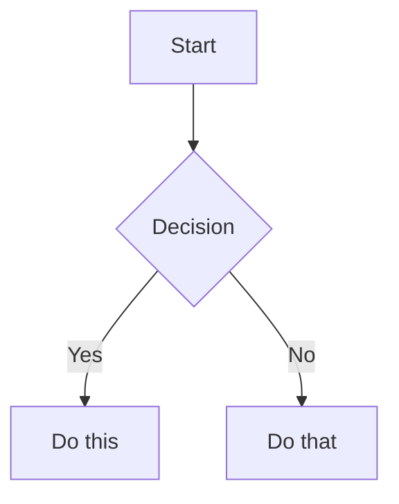

# Cron Job: Monthly Invoice Preparation

**Job ID:** 7a4e2eab7e53
**Run Time:** 2026-05-24 09:01:20
**Schedule:** 0 9 * * *

## Prompt

[IMPORTANT: The user has invoked the "obsidian" skill, indicating they want you to follow its instructions. The full skill content is loaded below.]

---
name: obsidian
description: Read, search, create, and edit notes in the Obsidian vault.
platforms: [linux, macos, windows]
---

# Obsidian Vault

Use this skill for filesystem-first Obsidian vault work: reading notes, listing notes, searching note files, creating notes, appending content, and adding wikilinks.

## Vault path

Use a known or resolved vault path before calling file tools.

The documented vault-path convention is the `OBSIDIAN_VAULT_PATH` environment variable, for example from `~/.hermes/.env`. If it is unset, use `~/Documents/Obsidian Vault`.

File tools do not expand shell variables. Do not pass paths containing `$OBSIDIAN_VAULT_PATH` to `read_file`, `write_file`, `patch`, or `search_files`; resolve the vault path first and pass a concrete absolute path. Vault paths may contain spaces, which is another reason to prefer file tools over shell commands.

If the vault path is unknown, `terminal` is acceptable for resolving `OBSIDIAN_VAULT_PATH` or checking whether the fallback path exists. Once the path is known, switch back to file tools.

## Installing Obsidian agent skill packs

When the user asks to install or configure Obsidian skills for Hermes from an external repo, use Hermes' skill tap/install commands rather than manually copying folders. For `kepano/obsidian-skills`, install the class-level skills that match common Obsidian work (`obsidian-cli`, `obsidian-markdown`, `obsidian-bases`, `json-canvas`) and configure the target vault path in `~/.hermes/.env` as `OBSIDIAN_VAULT_PATH="/absolute/vault/path"`. See `references/kepano-obsidian-skills.md` for the exact repo contents, install commands, CLI symlink pattern, and Obsidian app toggle needed for the official CLI.

## Read a note

Use `read_file` with the resolved absolute path to the note. Prefer this over `cat` because it provides line numbers and pagination.

## List notes

Use `search_files` with `target: "files"` and the resolved vault path. Prefer this over `find` or `ls`.

- To list all markdown notes, use `pattern: "*.md"` under the vault path.
- To list a subfolder, search under that subfolder's absolute path.

## Search

Use `search_files` for both filename and content searches. Prefer this over `grep`, `find`, or `ls`.

- For filenames, use `search_files` with `target: "files"` and a filename `pattern`.
- For note contents, use `search_files` with `target: "content"`, the content regex as `pattern`, and `file_glob: "*.md"` when you want to restrict matches to markdown notes.
- To find completed Obsidian Tasks plugin items, use date-stamp regex patterns (`✅ YYYY-MM-DD`, `✅ YYYY-MM-1[1-6]` for a week range, etc.). See `references/tasks-plugin-search.md` for patterns, pitfalls, and customer-correlation workflows.

## Create a note

Use `write_file` with the resolved absolute path and the full markdown content. Prefer this over shell heredocs or `echo` because it avoids shell quoting issues and returns structured results.

## Append to a note

Prefer a native file-tool workflow when it is not awkward:

- Read the target note with `read_file`.
- Use `patch` for an anchored append when there is stable context, such as adding a section after an existing heading or appending before a known trailing block.
- Use `write_file` when rewriting the whole note is clearer than constructing a fragile patch.

For an anchored append with `patch`, replace the anchor with the anchor plus the new content.

For a simple append with no stable context, `terminal` is acceptable if it is the clearest safe option.

## Targeted edits

Use `patch` for focused note changes when the current content gives you stable context. Prefer this over shell text rewriting.

## Vault documentation audits

When the user asks to make a vault section "up to date", "complete", or aligned with live system state, use the checklist in `references/vault-documentation-audit.md`. Key points: inventory authored notes, treat vendor/mirror/generated subtrees as reference unless explicitly asked to edit them, compare prose against live sources of truth, redact all secrets, preserve Obsidian workflow backlink blocks, verify stale paths/IDs are gone, and commit only scoped documentation changes when working in a git-backed vault.

## Eisenhower Task Prioritizer audits

When the user asks to prioritize unprioritized `#task` items across the vault, use the workflow detailed in `references/tasks-eisenhower-audit.md`. Key steps:
1. Search for all `#task` lines that lack priority signifiers (🔺 ⏫ 🔼 🔽 ⏬).
2. Exclude `90 - Templates/`, `99 - Archive/`, `.obsidian/`, `.trash/`, `Actieplan CyFUN compliance.md`, and cron output files.
3. Read 5–10 lines of context for each match.
4. Apply priority logic: deadlines/keywords → emoji signifier after description but before any 📅 date.
5. Patch each task line in place. Verify after every change.

**⚠️ Regex pitfall:** `search_files` regex engine may reject complex patterns (negative lookaheads, escaped brackets). If a pattern returns zero matches but you know tasks exist, fall back to reading files with `read_file` offset pagination. This happened reliably when using `\[`, `\]`, and lookahead syntax — the JSON-to-payload escaping strips one level.

## MOC link integrity audits

When the user asks to audit MOC wikilinks for broken references, use the workflow in `references/moc-integrity-audit.md`. Key points: find all `*MOC.md` and `*Overview.md` files, extract wikilinks with sed (not grep -P), batch-verify every target against the filesystem, repair only where the target clearly exists under a slightly different path/name, never create speculative notes, and exclude `90 - Templates/` and `99 - Archive/`.

## Daily timesheet pre-fill

When the user asks to pre-fill today's timesheet (for the Clawbot vault or similar setup), load `references/timesheet-prefill.md` and follow the full 6-step procedure. Key principles: estimate only from evidence, mark all estimates with `[ESTIMATE]`, flag uncertainties with `[CONFIRM: ...]`, compute running weekly totals by hand, and never fabricate activity or modify outside `## 📋 Timesheet`.

## Wikilinks

Obsidian links notes with `[[Note Name]]` syntax. When creating notes, use these to link related content.

[IMPORTANT: The user has invoked the "obsidian-markdown" skill, indicating they want you to follow its instructions. The full skill content is loaded below.]

---
name: obsidian-markdown
description: Create and edit Obsidian Flavored Markdown with wikilinks, embeds, callouts, properties, and other Obsidian-specific syntax. Use when working with .md files in Obsidian, or when the user mentions wikilinks, callouts, frontmatter, tags, embeds, or Obsidian notes.
---

# Obsidian Flavored Markdown Skill

Create and edit valid Obsidian Flavored Markdown. Obsidian extends CommonMark and GFM with wikilinks, embeds, callouts, properties, comments, and other syntax. This skill covers only Obsidian-specific extensions -- standard Markdown (headings, bold, italic, lists, quotes, code blocks, tables) is assumed knowledge.

## Workflow: Creating an Obsidian Note

1. **Add frontmatter** with properties (title, tags, aliases) at the top of the file. See [PROPERTIES.md](references/PROPERTIES.md) for all property types.
2. **Write content** using standard Markdown for structure, plus Obsidian-specific syntax below.
3. **Link related notes** using wikilinks (`[[Note]]`) for internal vault connections, or standard Markdown links for external URLs.
4. **Embed content** from other notes, images, or PDFs using the `![[embed]]` syntax. See [EMBEDS.md](references/EMBEDS.md) for all embed types.
5. **Add callouts** for highlighted information using `> [!type]` syntax. See [CALLOUTS.md](references/CALLOUTS.md) for all callout types.
6. **Verify** the note renders correctly in Obsidian's reading view.

> When choosing between wikilinks and Markdown links: use `[[wikilinks]]` for notes within the vault (Obsidian tracks renames automatically) and `[text](url)` for external URLs only.

## Internal Links (Wikilinks)

```markdown
[[Note Name]]                          Link to note
[[Note Name|Display Text]]             Custom display text
[[Note Name#Heading]]                  Link to heading
[[Note Name#^block-id]]                Link to block
[[#Heading in same note]]              Same-note heading link
```

Define a block ID by appending `^block-id` to any paragraph:

```markdown
This paragraph can be linked to. ^my-block-id
```

For lists and quotes, place the block ID on a separate line after the block:

```markdown
> A quote block

^quote-id
```

## Embeds

Prefix any wikilink with `!` to embed its content inline:

```markdown
![[Note Name]]                         Embed full note
![[Note Name#Heading]]                 Embed section
![[image.png]]                         Embed image
![[image.png|300]]                     Embed image with width
![[document.pdf#page=3]]               Embed PDF page
```

See [EMBEDS.md](references/EMBEDS.md) for audio, video, search embeds, and external images.

## Callouts

```markdown
> [!note]
> Basic callout.

> [!warning] Custom Title
> Callout with a custom title.

> [!faq]- Collapsed by default
> Foldable callout (- collapsed, + expanded).
```

Common types: `note`, `tip`, `warning`, `info`, `example`, `quote`, `bug`, `danger`, `success`, `failure`, `question`, `abstract`, `todo`.

See [CALLOUTS.md](references/CALLOUTS.md) for the full list with aliases, nesting, and custom CSS callouts.

## Properties (Frontmatter)

```yaml
---
title: My Note
date: 2024-01-15
tags:
  - project
  - active
aliases:
  - Alternative Name
cssclasses:
  - custom-class
---
```

Default properties: `tags` (searchable labels), `aliases` (alternative note names for link suggestions), `cssclasses` (CSS classes for styling).

See [PROPERTIES.md](references/PROPERTIES.md) for all property types, tag syntax rules, and advanced usage.

## Tags

```markdown
#tag                    Inline tag
#nested/tag             Nested tag with hierarchy
```

Tags can contain letters, numbers (not first character), underscores, hyphens, and forward slashes. Tags can also be defined in frontmatter under the `tags` property.

## Comments

```markdown
This is visible %%but this is hidden%% text.

%%
This entire block is hidden in reading view.
%%
```

## Obsidian-Specific Formatting

```markdown
==Highlighted text==                   Highlight syntax
```

## Math (LaTeX)

```markdown
Inline: $e^{i\pi} + 1 = 0$

Block:
$$
\frac{a}{b} = c
$$
```

## Diagrams (Mermaid)

````markdown

````

To link Mermaid nodes to Obsidian notes, add `class NodeName internal-link;`.

## Footnotes

```markdown
Text with a footnote[^1].

[^1]: Footnote content.

Inline footnote.^[This is inline.]
```

## Complete Example

````markdown
---
title: Project Alpha
date: 2024-01-15
tags:
  - project
  - active
status: in-progress
---

# Project Alpha

This project aims to [[improve workflow]] using modern techniques.

> [!important] Key Deadline
> The first milestone is due on ==January 30th==.

## Tasks

- [x] Initial planning
- [ ] Development phase
  - [ ] Backend implementation
  - [ ] Frontend design

## Notes

The algorithm uses $O(n \log n)$ sorting. See [[Algorithm Notes#Sorting]] for details.

![[Architecture Diagram.png|600]]

Reviewed in [[Meeting Notes 2024-01-10#Decisions]].
````

## References

- [Obsidian Flavored Markdown](https://help.obsidian.md/obsidian-flavored-markdown)
- [Internal links](https://help.obsidian.md/links)
- [Embed files](https://help.obsidian.md/embeds)
- [Callouts](https://help.obsidian.md/callouts)
- [Properties](https://help.obsidian.md/properties)

The user has provided the following instruction alongside the skill invocation: [IMPORTANT: You are running as a scheduled cron job. DELIVERY: Your final response will be automatically delivered to the user — do NOT use send_message or try to deliver the output yourself. Just produce your report/output as your final response and the system handles the rest. SILENT: If there is genuinely nothing new to report, respond with exactly "[SILENT]" (nothing else) to suppress delivery. Never combine [SILENT] with content — either report your findings normally, or say [SILENT] and nothing more.]

Run the monthly invoice preparation workflow for the Clawbot Obsidian vault at `/Users/absorbo/Library/Mobile Documents/com~apple~CloudDocs/AgentVault/Clawbot`.

Tasks:
1. Determine whether today is the second-to-last working day of the month, excluding weekends and Belgian holidays.
2. Belgian holidays 2026: 2026-01-01, 2026-04-06, 2026-05-01, 2026-05-14, 2026-05-25, 2026-07-21, 2026-08-15, 2026-11-01, 2026-11-11, 2026-12-25.
3. If today is NOT invoice day, stop immediately and report `SKIPPED: not invoice day. Next invoice day: YYYY-MM-DD.`.
4. If today IS invoice day, aggregate the entire month's `## 📋 Timesheet` sections from all daily notes.
5. Create `01 - Daily Notes/YYYY-MM-Invoice.md` with per-customer totals, rates, and amounts.
6. Flag all `[ESTIMATE]` hours as unresolved.
7. Draft submission email text in the invoice note only. Never send email.
8. Remind user: submit before noon, payment by last working day.

Customer map:
- Delvaux → Minotaur Solutions → OnePoint
- CAPAC-HVW → Futurwork → Futurwork
- Futurwork Direct → Futurwork (direct) → Futurwork
- Groep Brugge → Inetum → Inetum
- Inetum Direct → Inetum (direct) → Inetum
- Verlinfo/Verla → Xcellerate → Xcellerate

Hard constraints: never delete email; never send email; never delete files; never modify templates or archives; never fabricate amounts; use `[CONFIRM]` for uncertainty.

Operational gate: Before changing anything: read relevant vault documentation and current target files, form a brief plan, then act and verify. Do not act first and check later.
Final output: concise status only (changed/created/skipped counts and blockers/errors). Do not include long evidence dumps unless something needs user attention.

## Response

SKIPPED: not invoice day. Next invoice day: 2026-05-28.
