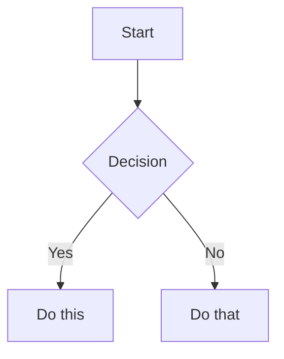

# Cron Job: Invoice & Payment Tracker

**Job ID:** 7eef85853197
**Run Time:** 2026-06-01 07:09:03
**Schedule:** 0 7 * * 1

## Prompt

[IMPORTANT: The user has invoked the "obsidian" skill, indicating they want you to follow its instructions. The full skill content is loaded below.]

---
name: obsidian
description: Read, search, create, and edit notes in the Obsidian vault.
platforms: [linux, macos, windows]
---

# Obsidian Vault

Use this skill for filesystem-first Obsidian vault work: reading notes, listing notes, searching note files, creating notes, appending content, and adding wikilinks.

## Vault path

Use a known or resolved vault path before calling file tools.

The documented vault-path convention is the `OBSIDIAN_VAULT_PATH` environment variable, for example from `~/.hermes/.env`. If it is unset, use `~/Documents/Obsidian Vault`.

File tools do not expand shell variables. Do not pass paths containing `$OBSIDIAN_VAULT_PATH` to `read_file`, `write_file`, `patch`, or `search_files`; resolve the vault path first and pass a concrete absolute path. Vault paths may contain spaces, which is another reason to prefer file tools over shell commands.

If the vault path is unknown, `terminal` is acceptable for resolving `OBSIDIAN_VAULT_PATH` or checking whether the fallback path exists. Once the path is known, switch back to file tools.

## Installing Obsidian agent skill packs

When the user asks to install or configure Obsidian skills for Hermes from an external repo, use Hermes' skill tap/install commands rather than manually copying folders. For `kepano/obsidian-skills`, install the class-level skills that match common Obsidian work (`obsidian-cli`, `obsidian-markdown`, `obsidian-bases`, `json-canvas`) and configure the target vault path in `~/.hermes/.env` as `OBSIDIAN_VAULT_PATH="/absolute/vault/path"`. See `references/kepano-obsidian-skills.md` for the exact repo contents, install commands, CLI symlink pattern, and Obsidian app toggle needed for the official CLI.

## Read a note

Use `read_file` with the resolved absolute path to the note. Prefer this over `cat` because it provides line numbers and pagination.

## List notes

Use `search_files` with `target: "files"` and the resolved vault path. Prefer this over `find` or `ls`.

- To list all markdown notes, use `pattern: "*.md"` under the vault path.
- To list a subfolder, search under that subfolder's absolute path.

## Search

Use `search_files` for both filename and content searches. Prefer this over `grep`, `find`, or `ls`.

- For filenames, use `search_files` with `target: "files"` and a filename `pattern`.
- For note contents, use `search_files` with `target: "content"`, the content regex as `pattern`, and `file_glob: "*.md"` when you want to restrict matches to markdown notes.
- To find completed Obsidian Tasks plugin items, use date-stamp regex patterns (`✅ YYYY-MM-DD`, `✅ YYYY-MM-1[1-6]` for a week range, etc.). See `references/tasks-plugin-search.md` for patterns, pitfalls, and customer-correlation workflows.

## Create a note

Use `write_file` with the resolved absolute path and the full markdown content. Prefer this over shell heredocs or `echo` because it avoids shell quoting issues and returns structured results.

## Append to a note

Prefer a native file-tool workflow when it is not awkward:

- Read the target note with `read_file`.
- Use `patch` for an anchored append when there is stable context, such as adding a section after an existing heading or appending before a known trailing block.
- Use `write_file` when rewriting the whole note is clearer than constructing a fragile patch.

For an anchored append with `patch`, replace the anchor with the anchor plus the new content.

For a simple append with no stable context, `terminal` is acceptable if it is the clearest safe option.

## Targeted edits

Use `patch` for focused note changes when the current content gives you stable context. Prefer this over shell text rewriting.

## Vault documentation audits

When the user asks to make a vault section "up to date", "complete", or aligned with live system state, use the checklist in `references/vault-documentation-audit.md`. Key points: inventory authored notes, treat vendor/mirror/generated subtrees as reference unless explicitly asked to edit them, compare prose against live sources of truth, redact all secrets, preserve Obsidian workflow backlink blocks, verify stale paths/IDs are gone, and commit only scoped documentation changes when working in a git-backed vault.

## Eisenhower Task Prioritizer audits

When the user asks to prioritize unprioritized `#task` items across the vault, use the workflow detailed in `references/tasks-eisenhower-audit.md`. Key steps:
1. Search for all `#task` lines that lack priority signifiers (🔺 ⏫ 🔼 🔽 ⏬).
2. Exclude `90 - Templates/`, `99 - Archive/`, `.obsidian/`, `.trash/`, `Actieplan CyFUN compliance.md`, and cron output files.
3. Read 5–10 lines of context for each match.
4. Apply priority logic: deadlines/keywords → emoji signifier after description but before any 📅 date.
5. Patch each task line in place. Verify after every change.

**⚠️ Regex pitfall:** `search_files` regex engine may reject complex patterns (negative lookaheads, escaped brackets). If a pattern returns zero matches but you know tasks exist, fall back to reading files with `read_file` offset pagination. This happened reliably when using `\[`, `\]`, and lookahead syntax — the JSON-to-payload escaping strips one level.

### Obsidian table reading pitfalls

When Obsidian notes contain Markdown tables (rows starting with `|`), `read_file`'s output format creates visual ambiguity:

```
LINE_NUM|CONTENT
60|| Week | LinkedIn A | LinkedIn B | ...
```

The first `|` is the tool's line-content separator. The second `|` is the actual file content (Obsidian table pipe). This makes every table start *look* like `||` — but that is **display confusion, not content corruption.**

**Verification protocol:** If `read_file` output looks weird on table rows (double pipes, extra spacing), verify with terminal: `sed -n '<start>,<end>p' "<vault-path>/<file>"`. The `patch` tool matches actual file content regardless of display.

This applies to any Markdown table in any vault file — status tables, checklists, comparison matrices, or pipeline snapshots.

## MOC link integrity audits

When the user asks to audit MOC wikilinks for broken references, use the workflow in `references/moc-integrity-audit.md`. Key points: find all `*MOC.md` and `*Overview.md` files, extract wikilinks with sed (not grep -P), batch-verify every target against the filesystem, repair only where the target clearly exists under a slightly different path/name, never create speculative notes, and exclude `90 - Templates/` and `99 - Archive/`.

## Daily timesheet pre-fill

When the user asks to pre-fill today's timesheet (for the Clawbot vault or similar setup), load `references/timesheet-prefill.md` and follow the full 6-step procedure. Key principles: estimate only from evidence, mark all estimates with `[ESTIMATE]`, flag uncertainties with `[CONFIRM: ...]`, compute running weekly totals by hand, and never fabricate activity or modify outside `## 📋 Timesheet`.

## Monthly invoice preparation

When the user asks to prepare the monthly invoice, run the invoice-day cron workflow, or aggregate the month's timesheets for billing, load `references/monthly-invoice-prep.md` and follow the full 6-step procedure. Key principles: verify invoice day (second-to-last working day excluding weekends and Belgian holidays), aggregate with `sed` extraction from daily notes, group by intermediary, flag all `[ESTIMATE]` and `[CONFIRM]` items, draft per-intermediary submission emails in the invoice note only (never send), and never fabricate rates or amounts.

## Weekly rollup (timesheet + compliance)

When the user asks to create the weekly rollup, run the Friday cron workflow, or aggregate the week's timesheets with compliance status, load `references/weekly-rollup.md` and follow the full 13-step procedure. Key principles: check EOD feedback BEFORE timesheet tables, cross-reference between daily notes for unlogged meetings (the `⚠️ Review Needed` callouts in the following day's pre-fill routinely catch prior-day gaps), flag zero-hour customers and days, detect compliance scope from frontmatter + CyFUN folder presence + keywords, never fabricate hours or compliance data, and always preserve `[ESTIMATE]`/`[CONFIRM]` uncertainty markers.

## Delvaux JIRA update

When the user asks to draft the Delvaux JIRA update, run the Delvaux JIRA update cron, or update the `## 🎫 JIRA Update` section in a daily note, load `references/delvaux-jira-update.md` and follow the full 5-step procedure. Key principles: gate on Wednesday/weekend/Belgian holiday, read the ritual template from `10 - Customers/Delvaux/JIRA-Update-Ritual.md`, build a week-picture by reading multiple daily notes (not just today's), anchor all items to the MCJ follow-up meeting (`2026-05-12_DELVAUX_MCJ-Follow-up-*.md`) for concrete workstreams, overwrite any auto-generated placeholder created by the timesheet pre-fill cron, and never fabricate standup attendance or progress.

## Wikilinks

Obsidian links notes with `[[Note Name]]` syntax. When creating notes, use these to link related content.

[IMPORTANT: The user has invoked the "obsidian-markdown" skill, indicating they want you to follow its instructions. The full skill content is loaded below.]

---
name: obsidian-markdown
description: Create and edit Obsidian Flavored Markdown with wikilinks, embeds, callouts, properties, and other Obsidian-specific syntax. Use when working with .md files in Obsidian, or when the user mentions wikilinks, callouts, frontmatter, tags, embeds, or Obsidian notes.
---

# Obsidian Flavored Markdown Skill

Create and edit valid Obsidian Flavored Markdown. Obsidian extends CommonMark and GFM with wikilinks, embeds, callouts, properties, comments, and other syntax. This skill covers only Obsidian-specific extensions -- standard Markdown (headings, bold, italic, lists, quotes, code blocks, tables) is assumed knowledge.

## Workflow: Creating an Obsidian Note

1. **Add frontmatter** with properties (title, tags, aliases) at the top of the file. See [PROPERTIES.md](references/PROPERTIES.md) for all property types.
2. **Write content** using standard Markdown for structure, plus Obsidian-specific syntax below.
3. **Link related notes** using wikilinks (`[[Note]]`) for internal vault connections, or standard Markdown links for external URLs.
4. **Embed content** from other notes, images, or PDFs using the `![[embed]]` syntax. See [EMBEDS.md](references/EMBEDS.md) for all embed types.
5. **Add callouts** for highlighted information using `> [!type]` syntax. See [CALLOUTS.md](references/CALLOUTS.md) for all callout types.
6. **Verify** the note renders correctly in Obsidian's reading view.

> When choosing between wikilinks and Markdown links: use `[[wikilinks]]` for notes within the vault (Obsidian tracks renames automatically) and `[text](url)` for external URLs only.

## Internal Links (Wikilinks)

```markdown
[[Note Name]]                          Link to note
[[Note Name|Display Text]]             Custom display text
[[Note Name#Heading]]                  Link to heading
[[Note Name#^block-id]]                Link to block
[[#Heading in same note]]              Same-note heading link
```

Define a block ID by appending `^block-id` to any paragraph:

```markdown
This paragraph can be linked to. ^my-block-id
```

For lists and quotes, place the block ID on a separate line after the block:

```markdown
> A quote block

^quote-id
```

## Embeds

Prefix any wikilink with `!` to embed its content inline:

```markdown
![[Note Name]]                         Embed full note
![[Note Name#Heading]]                 Embed section
![[image.png]]                         Embed image
![[image.png|300]]                     Embed image with width
![[document.pdf#page=3]]               Embed PDF page
```

See [EMBEDS.md](references/EMBEDS.md) for audio, video, search embeds, and external images.

## Callouts

```markdown
> [!note]
> Basic callout.

> [!warning] Custom Title
> Callout with a custom title.

> [!faq]- Collapsed by default
> Foldable callout (- collapsed, + expanded).
```

Common types: `note`, `tip`, `warning`, `info`, `example`, `quote`, `bug`, `danger`, `success`, `failure`, `question`, `abstract`, `todo`.

See [CALLOUTS.md](references/CALLOUTS.md) for the full list with aliases, nesting, and custom CSS callouts.

## Properties (Frontmatter)

```yaml
---
title: My Note
date: 2024-01-15
tags:
  - project
  - active
aliases:
  - Alternative Name
cssclasses:
  - custom-class
---
```

Default properties: `tags` (searchable labels), `aliases` (alternative note names for link suggestions), `cssclasses` (CSS classes for styling).

See [PROPERTIES.md](references/PROPERTIES.md) for all property types, tag syntax rules, and advanced usage.

## Tags

```markdown
#tag                    Inline tag
#nested/tag             Nested tag with hierarchy
```

Tags can contain letters, numbers (not first character), underscores, hyphens, and forward slashes. Tags can also be defined in frontmatter under the `tags` property.

## Comments

```markdown
This is visible %%but this is hidden%% text.

%%
This entire block is hidden in reading view.
%%
```

## Obsidian-Specific Formatting

```markdown
==Highlighted text==                   Highlight syntax
```

## Math (LaTeX)

```markdown
Inline: $e^{i\pi} + 1 = 0$

Block:
$$
\frac{a}{b} = c
$$
```

## Diagrams (Mermaid)

````markdown

````

To link Mermaid nodes to Obsidian notes, add `class NodeName internal-link;`.

## Footnotes

```markdown
Text with a footnote[^1].

[^1]: Footnote content.

Inline footnote.^[This is inline.]
```

## Complete Example

````markdown
---
title: Project Alpha
date: 2024-01-15
tags:
  - project
  - active
status: in-progress
---

# Project Alpha

This project aims to [[improve workflow]] using modern techniques.

> [!important] Key Deadline
> The first milestone is due on ==January 30th==.

## Tasks

- [x] Initial planning
- [ ] Development phase
  - [ ] Backend implementation
  - [ ] Frontend design

## Notes

The algorithm uses $O(n \log n)$ sorting. See [[Algorithm Notes#Sorting]] for details.

![[Architecture Diagram.png|600]]

Reviewed in [[Meeting Notes 2024-01-10#Decisions]].
````

## References

- [Obsidian Flavored Markdown](https://help.obsidian.md/obsidian-flavored-markdown)
- [Internal links](https://help.obsidian.md/links)
- [Embed files](https://help.obsidian.md/embeds)
- [Callouts](https://help.obsidian.md/callouts)
- [Properties](https://help.obsidian.md/properties)

[IMPORTANT: The user has invoked the "m365-graph" skill, indicating they want you to follow its instructions. The full skill content is loaded below.]

---
name: m365-graph
description: Microsoft 365 Graph API — mail (list, read, search, draft, reply), calendar, contacts, OneDrive, user profile. MSAL OAuth2 with PKCE. REQUIRES setup before use.
category: productivity
tags: [microsoft, m365, outlook, graph-api, email, calendar]
platforms: [macOS, linux]
dependencies:
  - python3
  - msal
  - requests
---

# Microsoft 365 Graph

> **Mail. Calendar. Contacts. OneDrive. User Profile. Full CRUD via MSAL OAuth2 with raw-token fallback.**

**Rule 0:** ⛔ **NEVER delete email. EVER.** No exceptions. Not trash, not deleted items. Non-negotiable.

## What It Does

| Service | Status | Notes |
|---------|--------|-------|
| **Mail** | ✅ Full | List inbox/sent, get full message, search, create draft, reply |
| **Calendar** | ✅ Read | Direct Graph API via same MSAL token — see `references/graph-calendar-access.md` |
| **Contacts** | ❌ Not supported | — |
| **OneDrive** | ❌ Not supported | — |
| **User Profile** | ❌ Not supported | — |

**Backend:** `scripts/m365_graph_mail.py` — Python CLI using MSAL with PKCE for mail operations. Calendar uses the same token infrastructure via direct `requests` calls to Graph endpoints.

> ⚠️ **Note:** The `m365_graph_mail.py` CLI only handles mail. For calendar events, use the direct Graph API pattern in `references/graph-calendar-access.md`. Google Calendar events can also be retrieved using the `google-workspace` skill (`$GAPI calendar list`).

## Prerequisites

### Required Files (on disk)

| File | Location | Purpose |
|------|----------|---------|
| `m365_graph_mail.json` | `~/.hermes/.local/` | Config: client_id, tenant_id |
| `m365_graph_token_cache.json` | `~/.hermes/.local/` | MSAL token cache |

### Required Python Packages

```bash
~/.hermes/hermes-agent/venv/bin/python3 -m pip install msal requests
```

### Required Azure AD Configuration

| Setting | Value |
|---------|-------|
| Application type | **Public client (mobile & desktop)** |
| Redirect URIs | `http://localhost` AND `http://localhost:8765` |
| Allow public client flows | **Yes** (required) |
| Required API Permissions | Mail.Read, Mail.ReadWrite, User.Read, offline_access |

## Quick Start

```bash
M365="python3 ~/.hermes/skills/productivity/m365-graph/scripts/m365_graph_mail.py"

# Setup config (one-time)
echo '{"client_id":"YOUR_CLIENT_ID","tenant_id":"YOUR_TENANT_ID"}' > ~/.hermes/.local/m365_graph_mail.json

# Authenticate (opens browser)
$M365 auth read

# Verify
$M365 list-messages --top 1
```

## Commands

### Auth
```bash
$M365 auth [read|draft|send|all]
```

### Mail
```bash
# List inbox
$M365 list-messages --top 10

# List sent items
$M365 list-sent --top 10

# Get full message
$M365 get-message MESSAGE_ID

# Search messages
$M365 search "project budget" --top 10

# Create draft
$M365 create-draft --to user@example.com --subject "Hello" --body "Message text"

# Reply to message
$M365 reply MESSAGE_ID --body "Thanks, that works for me."
```

## Rules

0. ⛔ **NEVER delete ANY email, EVER.** No exceptions. Not trash, not deleted items. Non-negotiable.
1. **Never send email, create/delete calendar events, or delete files without confirming with user first.**
2. **Check auth before first use** — run `auth read`.
3. **Respect rate limits** — avoid rapid-fire sequential calls.
4. **For legal evidence / court-case email extraction**, see `references/legal-evidence-email.md` — multi-pass search pattern, report structure, HTML cleaning, and vault location conventions.

## References

- `references/legal-evidence-email.md` — multi-pass search pattern for legal evidence email extraction
- `references/graph-calendar-access.md` — direct Graph Calendar API access using the same MSAL token infrastructure

## Troubleshooting

| Problem | Fix |
|---------|-----|
| `Missing config` | Create `~/.hermes/.local/m365_graph_mail.json` with client_id and tenant_id |
| `msal not installed` | `pip install msal requests` |
| `AADSTS700016` | Add `http://localhost` as redirect URI in Azure AD |
| `AADSTS7000218` | Portal → Authentication → "Allow public client flows" → Yes |
| `ModuleNotFoundError: No module named 'requests'` | Use venv Python: `~/.hermes/hermes-agent/venv/bin/python3`, NOT system `python3` |
| `SearchWithOrderBy` error | `$orderby` is not supported with `$search` — remove orderby from search queries or use list-messages and filter client-side |

### Known Pitfalls

1. **Search with ordering fails:** The Graph API does not support `$orderby` together with `$search`. Workaround: use `list-messages --top N` to fetch recent messages, then filter client-side by scanning for keywords.

2. **Calendar not in the CLI:** The `m365_graph_mail.py` script only handles mail endpoints. For calendar access, use the direct Graph API pattern in `references/graph-calendar-access.md` — it reuses the same MSAL token cache with zero additional setup.

3. **Reserved scopes crash MSAL:** When calling `acquire_token_silent()` for custom Graph endpoints, do NOT include `openid`, `profile`, or `email` in the scopes list — they are reserved and raise `ValueError`. Filter to only `https://graph.microsoft.com/...` scopes.

4. **Timezone offset encoding:** The `+` in `+02:00` timezone strings is not URL-safe. Always use `requests.get(url, params={...})` instead of manual URL construction — `requests` handles encoding.

## Cross-Platform Email Drafting (M365 + Gmail)

The Morning Briefing (`7cfde4ccf71b`, 04:00) fetches from BOTH M365 and Gmail. Draft creation is now supported uniformly on both platforms:

- **M365**: Full draft creation via `create-draft` command. Drafts go to M365 Drafts folder.
- **Gmail**: Full draft creation via `gmail draft` command in `google_api.py`. Drafts go to Gmail Drafts folder. NEVER use `gmail send` for drafting — it sends, not drafts.

Both platforms produce the same outcome: a Draft in the Drafts folder. Same workflow, same result.

## Cron / Automated Use

```bash
PYTHON=~/.hermes/hermes-agent/venv/bin/python3
$PYTHON ~/.hermes/skills/productivity/m365-graph/scripts/m365_graph_mail.py <command>
```

The system `python3` does NOT have `requests` installed. Cron sessions inherit the system Python unless explicitly overridden.

**Writing style for automated drafting (Maarten Loose):**
- Dutch/Flemish recipients: "Hallo," opening, "Mvg," then "Maarten" close
- English recipients: "Hello," opening, "Best regards," or mobile sig close
- Mobile signature line: "Sent with a mobile device, please forgive typos and brevity."
- Tone: Direct, warm, concise. Helpful for decisions and time — not pro-forma
- Learn from sent items with `list-sent --top 20` before drafting

## Auth Methods

1. **MSAL Interactive (primary):** Opens browser for user login
2. **Raw token fallback:** Device code auth for headless environments

## Credential File Map

```
~/.hermes/.local/
├── m365_graph_mail.json          ← Config: client_id, tenant_id
└── m365_graph_token_cache.json   ← MSAL token cache (auto-refreshes)
```

[IMPORTANT: The user has invoked the "google-workspace" skill, indicating they want you to follow its instructions. The full skill content is loaded below.]

---
name: google-workspace
description: "Gmail, Calendar, Drive, Docs, Sheets via gws CLI or Python."
version: 1.1.0
author: Nous Research
license: MIT
platforms: [linux, macos, windows]
required_credential_files:
  - path: google_token.json
    description: Google OAuth2 token (created by setup script)
  - path: google_client_secret.json
    description: Google OAuth2 client credentials (downloaded from Google Cloud Console)
metadata:
  hermes:
    tags: [Google, Gmail, Calendar, Drive, Sheets, Docs, Contacts, Email, OAuth]
    homepage: https://github.com/NousResearch/hermes-agent
    related_skills: [himalaya]
---

# Google Workspace

> ⛔ **Rule 0: NEVER delete email. EVER.** No exceptions. Not trash, not deleted items. Non-negotiable. Gmail `modify` may remove labels but must NEVER remove INBOX/SENT/ALL_MAIL labels. Do not offer. Do not suggest.

Gmail, Calendar, Drive, Contacts, Sheets, and Docs — through Hermes-managed OAuth and a thin CLI wrapper. When `gws` is installed, the skill uses it as the execution backend for broader Google Workspace coverage; otherwise it falls back to the bundled Python client implementation.

## References

- `references/gmail-search-syntax.md` — Gmail search operators (is:unread, from:, newer_than:, etc.)

## Scripts

- `scripts/setup.py` — OAuth2 setup (run once to authorize)
- `scripts/google_api.py` — compatibility wrapper CLI. It prefers `gws` for operations when available, while preserving Hermes' existing JSON output contract.
  ⚠️ Requires Python 3.10+ (uses `X | None` union syntax, breaks on 3.9). Always use the Hermes venv Python, never system `python3`.

## First-Time Setup

The setup is fully non-interactive — you drive it step by step so it works
on CLI, Telegram, Discord, or any platform.

Define a shorthand first:

```bash
GSETUP="python ${HERMES_HOME:-$HOME/.hermes}/skills/productivity/google-workspace/scripts/setup.py"
```

### Step 0: Check if already set up

```bash
$GSETUP --check
```

If it prints `AUTHENTICATED`, skip to Usage — setup is already done.

### Step 1: Triage — ask the user what they need

Before starting OAuth setup, ask the user TWO questions:

**Question 1: "What Google services do you need? Just email, or also
Calendar/Drive/Sheets/Docs?"**

- **Email only** → They don't need this skill at all. Use the `himalaya` skill
  instead — it works with a Gmail App Password (Settings → Security → App
  Passwords) and takes 2 minutes to set up. No Google Cloud project needed.
  Load the himalaya skill and follow its setup instructions.

- **Email + Calendar** → Continue with this skill, but use
  `--services email,calendar` during auth so the consent screen only asks for
  the scopes they actually need.

- **Calendar/Drive/Sheets/Docs only** → Continue with this skill and use a
  narrower `--services` set like `calendar,drive,sheets,docs`.

- **Full Workspace access** → Continue with this skill and use the default
  `all` service set.

**Question 2: "Does your Google account use Advanced Protection (hardware
security keys required to sign in)? If you're not sure, you probably don't
— it's something you would have explicitly enrolled in."**

- **No / Not sure** → Normal setup. Continue below.
- **Yes** → Their Workspace admin must add the OAuth client ID to the org's
  allowed apps list before Step 4 will work. Let them know upfront.

### Step 2: Create OAuth credentials (one-time, ~5 minutes)

Tell the user:

> You need a Google Cloud OAuth client. This is a one-time setup:
>
> 1. Create or select a project:
>    https://console.cloud.google.com/projectselector2/home/dashboard
> 2. Enable the required APIs from the API Library:
>    https://console.cloud.google.com/apis/library
>    Enable: Gmail API, Google Calendar API, Google Drive API,
>    Google Sheets API, Google Docs API, People API
> 3. Create the OAuth client here:
>    https://console.cloud.google.com/apis/credentials
>    Credentials → Create Credentials → OAuth 2.0 Client ID
> 4. Application type: "Desktop app" → Create
> 5. If the app is still in Testing, add the user's Google account as a test user here:
>    https://console.cloud.google.com/auth/audience
>    Audience → Test users → Add users
> 6. Download the JSON file and tell me the file path
>
> Important Hermes CLI note: if the file path starts with `/`, do NOT send only the bare path as its own message in the CLI, because it can be mistaken for a slash command. Send it in a sentence instead, like:
> `The JSON file path is: /home/user/Downloads/client_secret_....json`

Once they provide the path:

```bash
$GSETUP --client-secret /path/to/client_secret.json
```

If they paste the raw client ID / client secret values instead of a file path,
write a valid Desktop OAuth JSON file for them yourself, save it somewhere
explicit (for example `~/Downloads/hermes-google-client-secret.json`), then run
`--client-secret` against that file.

### Step 3: Get authorization URL

The installed setup script supports a single all-scopes auth URL command. It does **not** support `--services` or `--format` on this host.

```bash
$GSETUP --auth-url
```

This prints the exact OAuth URL to stdout.

Agent rules for this step:
- Send that exact URL to the user as a single line.
- Tell the user that the browser will likely fail on `http://localhost:1` after approval, and that this is expected.
- Tell them to copy the ENTIRE redirected URL from the browser address bar.
- If the user gets `Error 403: access_denied`, send them directly to `https://console.cloud.google.com/auth/audience` to add themselves as a test user.

### Step 4: Exchange the code

The user will paste back either a URL like `http://localhost:1/?code=4/0A...&scope=...`
or just the code string. Either works. The `--auth-url` step stores a temporary
pending OAuth session locally so `--auth-code` can complete the PKCE exchange
later, even on headless systems:

```bash
$GSETUP --auth-code "THE_URL_OR_CODE_THE_USER_PASTED" --format json
```

If `--auth-code` fails because the code expired, was already used, or came from
an older browser tab, it now returns a fresh `fresh_auth_url`. In that case,
immediately send the new URL to the user and have them retry with the newest
browser redirect only.

### Step 5: Verify

```bash
$GSETUP --check
```

Should print `AUTHENTICATED`. Setup is complete — token refreshes automatically from now on.

### Notes

- Token is stored at `~/.hermes/google_token.json` and auto-refreshes.
- Pending OAuth session state/verifier are stored temporarily at `~/.hermes/google_oauth_pending.json` until exchange completes.
- If `gws` is installed, `google_api.py` points it at the same `~/.hermes/google_token.json` credentials file. Users do not need to run a separate `gws auth login` flow.
- To revoke: `$GSETUP --revoke`

## Usage

All commands go through the API script. Set `GAPI` as a shorthand:

```bash
GAPI="python ${HERMES_HOME:-$HOME/.hermes}/skills/productivity/google-workspace/scripts/google_api.py"
```

### Gmail

```bash
# Search (returns JSON array with id, from, subject, date, snippet)
$GAPI gmail search "is:unread" --max 10
$GAPI gmail search "from:boss@company.com newer_than:1d"
$GAPI gmail search "has:attachment filename:pdf newer_than:7d"

# Read full message (returns JSON with body text)
$GAPI gmail get MESSAGE_ID

# Send
$GAPI gmail send --to user@example.com --subject "Hello" --body "Message text"
$GAPI gmail send --to user@example.com --subject "Report" --body "<h1>Q4</h1><p>Details...</p>" --html
$GAPI gmail send --to user@example.com --subject "Hello" --from '"Research Agent" <user@example.com>' --body "Message text"

# Reply (automatically threads and sets In-Reply-To)
$GAPI gmail reply MESSAGE_ID --body "Thanks, that works for me."
$GAPI gmail reply MESSAGE_ID --from '"Support Bot" <user@example.com>' --body "Thanks"

# Labels
$GAPI gmail labels
$GAPI gmail modify MESSAGE_ID --add-labels LABEL_ID
$GAPI gmail modify MESSAGE_ID --remove-labels UNREAD
```

# Draft (creates a Draft in Gmail — NEVER sends)
$GAPI gmail draft --to user@example.com --subject "Re: Original Subject" --body "Draft text here"
$GAPI gmail draft --to user@example.com --subject "Re: Report" --body "<h1>Draft</h1>" --html

### Calendar

```bash
# List events (defaults to next 7 days)
$GAPI calendar list
$GAPI calendar list --start 2026-03-01T00:00:00Z --end 2026-03-07T23:59:59Z

# Create event (ISO 8601 with timezone required)
$GAPI calendar create --summary "Team Standup" --start 2026-03-01T10:00:00-06:00 --end 2026-03-01T10:30:00-06:00
$GAPI calendar create --summary "Lunch" --start 2026-03-01T12:00:00Z --end 2026-03-01T13:00:00Z --location "Cafe"
$GAPI calendar create --summary "Review" --start 2026-03-01T14:00:00Z --end 2026-03-01T15:00:00Z --attendees "alice@co.com,bob@co.com"

# Delete event
$GAPI calendar delete EVENT_ID
```

### Drive

```bash
# Search existing files
$GAPI drive search "quarterly report" --max 10
$GAPI drive search "mimeType='application/pdf'" --raw-query --max 5

# Get metadata for a single file
$GAPI drive get FILE_ID

# Upload a local file (auto-detects MIME type)
$GAPI drive upload /path/to/report.pdf
$GAPI drive upload /path/to/image.png --name "Logo.png" --parent FOLDER_ID

# Download (binary files download as-is; Google-native files export to a
# sensible default — Docs→pdf, Sheets→csv, Slides→pdf, Drawings→png)
$GAPI drive download FILE_ID
$GAPI drive download DOC_ID --output ~/doc.pdf
$GAPI drive download DOC_ID --export-mime text/plain --output ~/doc.txt

# Create a folder
$GAPI drive create-folder "Reports"
$GAPI drive create-folder "Q4" --parent FOLDER_ID

# Share
$GAPI drive share FILE_ID --email alice@example.com --role reader
$GAPI drive share FILE_ID --email alice@example.com --role writer --notify
$GAPI drive share FILE_ID --type anyone --role reader        # anyone with link
$GAPI drive share FILE_ID --type domain --domain example.com --role reader

# Delete — defaults to trash (reversible). Use --permanent to skip the trash.
$GAPI drive delete FILE_ID
$GAPI drive delete FILE_ID --permanent
```

### Contacts

```bash
$GAPI contacts list --max 20
```

### Sheets

```bash
# Create a new spreadsheet
$GAPI sheets create --title "Q4 Budget"
$GAPI sheets create --title "Inventory" --sheet-name "Stock"

# Read
$GAPI sheets get SHEET_ID "Sheet1!A1:D10"

# Write
$GAPI sheets update SHEET_ID "Sheet1!A1:B2" --values '[["Name","Score"],["Alice","95"]]'

# Append rows
$GAPI sheets append SHEET_ID "Sheet1!A:C" --values '[["new","row","data"]]'
```

### Docs

```bash
# Read
$GAPI docs get DOC_ID

# Create a new Doc (optionally seeded with body text)
$GAPI docs create --title "Meeting Notes"
$GAPI docs create --title "Draft" --body "First paragraph..."

# Append text to the end of an existing Doc
$GAPI docs append DOC_ID --text "Additional content to append"
```

## Output Format

All commands return JSON. Parse with `jq` or read directly. Key fields:

- **Gmail search**: `[{id, threadId, from, to, subject, date, snippet, labels}]`
- **Gmail get**: `{id, threadId, from, to, subject, date, labels, body}`
- **Gmail send/reply**: `{status: "sent", id, threadId}`
- **Gmail draft**: `{status: "drafted", id, message: {id}}`
- **Calendar list**: `[{id, summary, start, end, location, description, htmlLink}]`
- **Calendar create**: `{status: "created", id, summary, htmlLink}`
- **Drive search**: `[{id, name, mimeType, modifiedTime, webViewLink}]`
- **Drive get**: `{id, name, mimeType, modifiedTime, size, webViewLink, parents, owners}`
- **Drive upload**: `{status: "uploaded", id, name, mimeType, webViewLink}`
- **Drive download**: `{status: "downloaded", id, name, path, mimeType}`
- **Drive create-folder**: `{status: "created", id, name, webViewLink}`
- **Drive share**: `{status: "shared", permissionId, fileId, role, type}`
- **Drive delete**: `{status: "trashed" | "deleted", fileId, permanent}`
- **Contacts list**: `[{name, emails: [...], phones: [...]}]`
- **Sheets get**: `[[cell, cell, ...], ...]`
- **Sheets create**: `{status: "created", spreadsheetId, title, spreadsheetUrl}`
- **Docs create**: `{status: "created", documentId, title, url}`
- **Docs append**: `{status: "appended", documentId, inserted_at, characters}`

## Rules

1. **Never send email, create/delete calendar events, delete Drive files, share files, or modify Docs/Sheets without confirming with the user first.** Show what will be done (recipients, file IDs, content, share role) and ask for approval. For `drive delete`, prefer the default trash (reversible) over `--permanent`.
2. **Check auth before first use** — run `setup.py --check`. If it fails, guide the user through setup.
3. **Use the Gmail search syntax reference** for complex queries — load it with `skill_view("google-workspace", file_path="references/gmail-search-syntax.md")`.
4. **Calendar times must include timezone** — always use ISO 8601 with offset (e.g., `2026-03-01T10:00:00-06:00`) or UTC (`Z`).
5. **Respect rate limits** — avoid rapid-fire sequential API calls. Batch reads when possible.

## Troubleshooting

| Problem | Fix |
|---------|-----|
| `NOT_AUTHENTICATED` | Run setup Steps 2-5 above |
| `REFRESH_FAILED` | Token revoked or expired — redo Steps 3-5 |
| `HttpError 403: Insufficient Permission` | Missing API scope — `$GSETUP --revoke` then redo Steps 3-5 |
| `AUTHENTICATED (partial)` or "Token missing scopes" | New write capabilities (Drive write/delete, Docs create/edit) require re-authorization. `$GSETUP --revoke` then redo Steps 3-5 to grant the upgraded scopes. |
| `HttpError 403: Access Not Configured` | API not enabled — user needs to enable it in Google Cloud Console |
| `ModuleNotFoundError` | Run `$GSETUP --install-deps` |
| `TypeError: unsupported operand type(s) for |: 'type' and 'NoneType'` | You're using system Python < 3.10. Use venv Python: `~/.hermes/hermes-agent/venv/bin/python3`. Common in cron where `$PATH` picks up system `python3`. |
| Advanced Protection blocks auth | Workspace admin must allowlist the OAuth client ID |

## Revoking Access

```bash
$GSETUP --revoke
```

[IMPORTANT: The user has invoked the "ocr-and-documents" skill, indicating they want you to follow its instructions. The full skill content is loaded below.]

---
name: ocr-and-documents
description: "Extract text from PDFs/scans (pymupdf, marker-pdf)."
version: 2.3.0
author: Hermes Agent
license: MIT
platforms: [linux, macos, windows]
metadata:
  hermes:
    tags: [PDF, Documents, Research, Arxiv, Text-Extraction, OCR]
    related_skills: [powerpoint]
---

# PDF & Document Extraction

For DOCX: use `python-docx` (parses actual document structure, far better than OCR).
For PPTX: see the `powerpoint` skill (uses `python-pptx` with full slide/notes support).
This skill covers **PDFs and scanned documents**.

## Step 1: Remote URL Available?

If the document has a URL, **always try `web_extract` first**:

```
web_extract(urls=["https://arxiv.org/pdf/2402.03300"])
web_extract(urls=["https://example.com/report.pdf"])
```

This handles PDF-to-markdown conversion via Firecrawl with no local dependencies.

Only use local extraction when: the file is local, web_extract fails, or you need batch processing.

## Step 2: Choose Local Extractor

| Feature | pymupdf (~25MB) | marker-pdf (~3-5GB) |
|---------|-----------------|---------------------|
| **Text-based PDF** | ✅ | ✅ |
| **Scanned PDF (OCR)** | ❌ | ✅ (90+ languages) |
| **Tables** | ✅ (basic) | ✅ (high accuracy) |
| **Equations / LaTeX** | ❌ | ✅ |
| **Code blocks** | ❌ | ✅ |
| **Forms** | ❌ | ✅ |
| **Headers/footers removal** | ❌ | ✅ |
| **Reading order detection** | ❌ | ✅ |
| **Images extraction** | ✅ (embedded) | ✅ (with context) |
| **Images → text (OCR)** | ❌ | ✅ |
| **EPUB** | ✅ | ✅ |
| **Markdown output** | ✅ (via pymupdf4llm) | ✅ (native, higher quality) |
| **Install size** | ~25MB | ~3-5GB (PyTorch + models) |
| **Speed** | Instant | ~1-14s/page (CPU), ~0.2s/page (GPU) |

**Decision**: Use pymupdf unless you need OCR, equations, forms, or complex layout analysis.

If the user needs marker capabilities but the system lacks ~5GB free disk:
> "This document needs OCR/advanced extraction (marker-pdf), which requires ~5GB for PyTorch and models. Your system has [X]GB free. Options: free up space, provide a URL so I can use web_extract, or I can try pymupdf which works for text-based PDFs but not scanned documents or equations."

---

## pymupdf (lightweight)

```bash
pip install pymupdf pymupdf4llm
```

**Via helper script**:
```bash
python scripts/extract_pymupdf.py document.pdf              # Plain text
python scripts/extract_pymupdf.py document.pdf --markdown    # Markdown
python scripts/extract_pymupdf.py document.pdf --tables      # Tables
python scripts/extract_pymupdf.py document.pdf --images out/ # Extract images
python scripts/extract_pymupdf.py document.pdf --metadata    # Title, author, pages
python scripts/extract_pymupdf.py document.pdf --pages 0-4   # Specific pages
```

**Inline**:
```bash
python3 -c "
import pymupdf
doc = pymupdf.open('document.pdf')
for page in doc:
    print(page.get_text())
"
```

---

## marker-pdf (high-quality OCR)

```bash
# Check disk space first
python scripts/extract_marker.py --check

pip install marker-pdf
```

**Via helper script**:
```bash
python scripts/extract_marker.py document.pdf                # Markdown
python scripts/extract_marker.py document.pdf --json         # JSON with metadata
python scripts/extract_marker.py document.pdf --output_dir out/  # Save images
python scripts/extract_marker.py scanned.pdf                 # Scanned PDF (OCR)
python scripts/extract_marker.py document.pdf --use_llm      # LLM-boosted accuracy
```

**CLI** (installed with marker-pdf):
```bash
marker_single document.pdf --output_dir ./output
marker /path/to/folder --workers 4    # Batch
```

---

## Arxiv Papers

```
# Abstract only (fast)
web_extract(urls=["https://arxiv.org/abs/2402.03300"])

# Full paper
web_extract(urls=["https://arxiv.org/pdf/2402.03300"])

# Search
web_search(query="arxiv GRPO reinforcement learning 2026")
```

## Split, Merge & Search

pymupdf handles these natively — use `execute_code` or inline Python:

```python
# Split: extract pages 1-5 to a new PDF
import pymupdf
doc = pymupdf.open("report.pdf")
new = pymupdf.open()
for i in range(5):
    new.insert_pdf(doc, from_page=i, to_page=i)
new.save("pages_1-5.pdf")
```

```python
# Merge multiple PDFs
import pymupdf
result = pymupdf.open()
for path in ["a.pdf", "b.pdf", "c.pdf"]:
    result.insert_pdf(pymupdf.open(path))
result.save("merged.pdf")
```

```python
# Search for text across all pages
import pymupdf
doc = pymupdf.open("report.pdf")
for i, page in enumerate(doc):
    results = page.search_for("revenue")
    if results:
        print(f"Page {i+1}: {len(results)} match(es)")
        print(page.get_text("text"))
```

No extra dependencies needed — pymupdf covers split, merge, search, and text extraction in one package.

---

## Wrapper-Note Pattern (Obsidian vaults)

Some PDFs — government booklets, heavily formatted compliance documents, diagrams — produce poor or unreadable markdown when extracted. For these, **keep the PDF as-is** with a `.md` wrapper note that embeds it via Obsidian's native PDF embed (`![[file.pdf]]`). This preserves the document for human readability in Obsidian.

Store agent-readable extracts in a parallel `_extracted/` directory:

```
99-Documentation/
├── Attachments/
│   └── framework-booklet.pdf          ← Original PDF (human-readable in Obsidian)
├── framework-booklet.md               ← Wrapper note (embeds PDF via ![[...]])
└── _extracted/
    └── framework-booklet.md           ← Agent-readable markdown (pymupdf extract)
```

The wrapper note frontmatter should include:
```yaml
record-type: source-document
source-type: pdf
rendering-method: native-obsidian-pdf-embed
status: verified-wrapper
```

**Decision flow**: Test pymupdf extraction on 3–5 sample pages FIRST. If text is readable (control IDs, headings, body text) → convert and store in `_extracted/`. If garbled (scanned images, complex tables, diagrams as images) → use the wrapper-note pattern only, and the PDF stays human-readable in Obsidian.

## Pitfalls

- **Never propose PDF conversion without testing it first.** Run pymupdf on the actual PDF and read the output. Government/compliance PDFs with heavy formatting often produce garbage with marker-pdf but readable text with pymupdf. The user may have already tried extraction and settled on wrappers for good reason — test before recommending changes.
- **Do NOT assume marker-pdf is better.** For text-based formatted PDFs (government booklets, compliance frameworks), pymupdf often produces cleaner output. marker-pdf's OCR pipeline can mangle text-based PDFs by treating them as images.

## Notes

- `web_extract` is always first choice for URLs
- pymupdf is the safe default — instant, no models, works everywhere
- marker-pdf is for OCR, scanned docs, equations, complex layouts — install only when needed
- Both helper scripts accept `--help` for full usage
- marker-pdf downloads ~2.5GB of models to `~/.cache/huggingface/` on first use
- For Word docs: `pip install python-docx` (better than OCR — parses actual structure)
- For PowerPoint: see the `powerpoint` skill (uses python-pptx)

The user has provided the following instruction alongside the skill invocation: [IMPORTANT: You are running as a scheduled cron job. DELIVERY: Your final response will be automatically delivered to the user — do NOT use send_message or try to deliver the output yourself. Just produce your report/output as your final response and the system handles the rest. SILENT: If there is genuinely nothing new to report, respond with exactly "[SILENT]" (nothing else) to suppress delivery. Never combine [SILENT] with content — either report your findings normally, or say [SILENT] and nothing more.]

Run the weekly invoice and payment tracker for the Clawbot Obsidian vault at `/Users/absorbo/Library/Mobile Documents/iCloud~md~obsidian/Documents/Obsidian`.

Important paths:
- Entities: `11 - Entities/`
- M365 script: `/Users/absorbo/.hermes/skills/productivity/m365-graph/scripts/m365_graph_mail.py`
- Gmail script: `/Users/absorbo/.hermes/skills/productivity/google-workspace/scripts/google_api.py`
- Python: `/Users/absorbo/.hermes/hermes-agent/venv/bin/python3`

Tasks:
1. Identify ALL entities:
   - List all folders in `11 - Entities/`.
   - Read each `00-Overview.md`.
   - Track ALL entities — Active and Dormant. Dormant entities have recurring admin obligations (annual filings, tax returns, registrations) that generate invoices.
   - Return the full entity list with status noted.

2. For each entity, search M365 mailbox (ALL folders: Inbox, Sent Items, and any subfolder — invoices may be auto-routed) for ALL invoice-related emails:
   - Dutch: "factuur", "rekening", "betalingsachterstand", "aanmaning", "onbetaalde", "openstaande", "betaling"
   - English: "invoice", "payment", "statement", "due", "overdue", "reminder", "collection", "outstanding", "receipt"
   - Goal: catch ALL incoming invoices, not just overdue ones — so payments can be made on time.
   - Extract: sender, amount, due date, reference number, date received.

3. For each entity, search Gmail (ALL folders — invoices may be auto-routed) using the same terms.

4. For each email with attachments:
   - Download PDF/image attachments (invoices are often PDFs).
   - Extract text from PDFs using `pymupdf` or the `ocr-and-documents` skill.
   - Scan extracted text for: invoice number, amount, due date, IBAN/BBAN, structured communication (+++...+++), sender details.
   - Add extracted invoice data to the tracking list.
   - Delete the downloaded PDF immediately after extraction — DO NOT leave clutter.

5. For each found invoice/reminder, cross-reference sent items:
   - M365 sent: has Maarten already replied?
   - Gmail sent: same check.
   - Mark each as "Responded" or "Awaiting Response".

6. For each entity, compile per-entity invoice status:
   - Calculate days overdue (today - due date).
   - Flag unresolved > 7 days.
   - New invoices this week → highlight.

7. Create/update `11 - Entities/<name>/Payment Calendar.md` for each entity:
   - Table: Date | Sender | Reference | Amount | Due Date | Status (Paid/Open/Overdue) | Days Overdue | Response Status
   - Running total: sum of all open amounts.
   - Monthly outgoing sum: total per calendar month.
   - Balance section: total paid vs total open.
   - Include ALL payment details — invoices, amounts, dates, references, senders — so no time is lost looking up details.

8. Report summary:
   - Per entity: count of open invoices, total open amount, oldest overdue, unresolved count.
   - Global: total open across all entities.
   - Flagged: entities with unresolved > 7 days.

Constraints: never delete files; never delete email; never send email; never modify templates or archives; never fabricate amounts or dates; preserve existing payment calendar data — only add/update, never overwrite manually entered information.

Operational gate: Before changing anything: read relevant vault documentation and current target files, form a brief plan, then act and verify. Do not act first and check later.
Final output: concise status only (changed/created/updated counts and flagged items). Do not include long evidence dumps unless something needs user attention.

## Response

## Weekly Invoice & Payment Tracker — Summary

### Entities Scanned: 8 (7 Active, 1 Dormant)

| Entity | Jurisdiction | Status | Open | Overdue | Flagged |
|--------|-------------|--------|------|---------|---------|
| **Eldenwyck & Co** | Georgia, USA | Active | 0 | 0 | — |
| **Loose Maarten CommV** | Belgium | Active | 5 | **4** | ⚠️ 3 |
| **Minotaur Solutions** | Belgium | Active | 0 | 0 | — |
| **Oxford Holdings** | Bulgaria | Active | 0 | 0 | — |
| **Privacy Services LLC** | New Mexico, USA | Active | 0 | 0 | — |
| **REAT Europe** | TBC | Active | 0 | 0 | — |
| **TruSecure** | Romania | Active | 3 | 1 | ⚠️ 1 |
| **TruSecure UK** | United Kingdom | Dormant | 0 | 0 | — |

---

### ⚠️ Loose Maarten CommV — €3,295.15+ open (4 invoices)

| Invoice | Amount | Due | Days Overdue | Action Needed |
|---------|--------|-----|-------------|---------------|
| **Leaseline 12267** (Belcar) | €2,043.68 | 30/04/2026 | **32** | Maarten replied 2026-05-18 — **payment pending** |
| **Enwyse F-2026020482** | €581.22 | 22/04/2026 | **39** | 3 reminders sent — **no response, likely unpaid** |
| **WEX BE41127482** | €111.11 | 02/05/2026 | **30** | Dom. rejected — **manual bank transfer required** |
| **Enwyse F-2026027153** | €549.14 | 22/05/2026 | **10** | Reminder sent 26/05 |
| Belcar May 2026 (Peppol) | [pending] | ? | — | PDF not yet extracted |

IBANs: Leaseline → BE37 0689 5282 1428 | Enwyse → BE64 7330 7189 8652 | WEX → NL83DEUT0265256550

---

### ⚠️ TruSecure — pending confirmation

| Invoice | Amount | Status |
|---------|--------|--------|
| **Clevver.io** | [CONFIRM] | Account disabled — multiple reminders |
| **Diversus Group** (Billtobox 26030) | [CONFIRM] | Received via Billtobox |
| **Diversus Group** (Billtobox 26032) | [CONFIRM] | Received 2026-05-31 via Billtobox |
| OVHcloud IE2054885 | €8.46 | Likely auto-paid |

---

### Files Created: 8 Payment Calendar.md

```
11 - Entities/Eldenwyck-Co/Payment Calendar.md
11 - Entities/Loose Maarten CommV/Payment Calendar.md
11 - Entities/Minotaur-Solutions/Payment Calendar.md
11 - Entities/Oxford-Holdings/Payment Calendar.md
11 - Entities/Privacy-Services-LLC/Payment Calendar.md
11 - Entities/REAT Europe/Payment Calendar.md
11 - Entities/TruSecure/Payment Calendar.md
11 - Entities/TruSecure-UK/Payment Calendar.md
```

---

### Items Requiring User Confirmation

1. **Loose Maarten CommV**: Pay Leaseline 12267 (€2,043.68) — replied but not yet paid
2. **Loose Maarten CommV**: Pay Enwyse F-2026020482 (€581.22) — no payment found
3. **Loose Maarten CommV**: Pay WEX BE41127482 (€111.11) — manual transfer needed
4. **Loose Maarten CommV**: Confirm Belcar May 2026 Peppol invoice amount/due date
5. **TruSecure**: Confirm Clevver.io outstanding amount
6. **TruSecure**: Extract Diversus Billtobox PDF invoices for amounts/due dates
