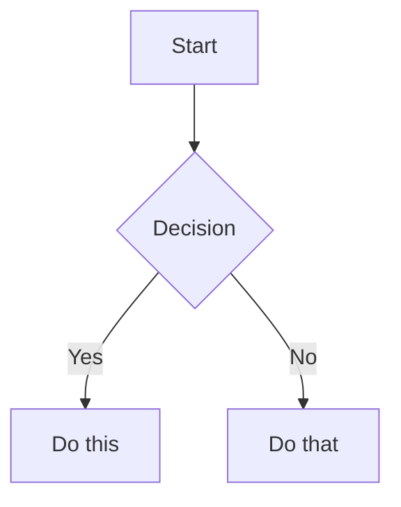

# Cron Job: Evening Timesheet Pre-Fill

**Job ID:** 924256021e15
**Run Time:** 2026-06-08 17:02:14
**Schedule:** 0 17 * * *

## Prompt

[IMPORTANT: The user has invoked the "obsidian" skill, indicating they want you to follow its instructions. The full skill content is loaded below.]

---
name: obsidian
description: Read, search, create, and edit notes in the Obsidian vault.
platforms: [linux, macos, windows]
---

# Obsidian Vault

Use this skill for filesystem-first Obsidian vault work: reading notes, listing notes, searching note files, creating notes, appending content, and adding wikilinks.

## Vault path

Use a known or resolved vault path before calling file tools.

The documented vault-path convention is the `OBSIDIAN_VAULT_PATH` environment variable, for example from `~/.hermes/.env`. If it is unset, use `~/Documents/Obsidian Vault`.

File tools do not expand shell variables. Do not pass paths containing `$OBSIDIAN_VAULT_PATH` to `read_file`, `write_file`, `patch`, or `search_files`; resolve the vault path first and pass a concrete absolute path. Vault paths may contain spaces, which is another reason to prefer file tools over shell commands.

If the vault path is unknown, `terminal` is acceptable for resolving `OBSIDIAN_VAULT_PATH` or checking whether the fallback path exists. Once the path is known, switch back to file tools.

## Installing Obsidian agent skill packs

When the user asks to install or configure Obsidian skills for Hermes from an external repo, use Hermes' skill tap/install commands rather than manually copying folders. For `kepano/obsidian-skills`, install the class-level skills that match common Obsidian work (`obsidian-cli`, `obsidian-markdown`, `obsidian-bases`, `json-canvas`) and configure the target vault path in `~/.hermes/.env` as `OBSIDIAN_VAULT_PATH="/absolute/vault/path"`. See `references/kepano-obsidian-skills.md` for the exact repo contents, install commands, CLI symlink pattern, and Obsidian app toggle needed for the official CLI.

## Read a note

Use `read_file` with the resolved absolute path to the note. Prefer this over `cat` because it provides line numbers and pagination.

## List notes

Use `search_files` with `target: "files"` and the resolved vault path. Prefer this over `find` or `ls`.

- To list all markdown notes, use `pattern: "*.md"` under the vault path.
- To list a subfolder, search under that subfolder's absolute path.

## Search

Use `search_files` for both filename and content searches. Prefer this over `grep`, `find`, or `ls`.

- For filenames, use `search_files` with `target: "files"` and a filename `pattern`.
- For note contents, use `search_files` with `target: "content"`, the content regex as `pattern`, and `file_glob: "*.md"` when you want to restrict matches to markdown notes.
- To find completed Obsidian Tasks plugin items, use date-stamp regex patterns (`✅ YYYY-MM-DD`, `✅ YYYY-MM-1[1-6]` for a week range, etc.). See `references/tasks-plugin-search.md` for patterns, pitfalls, and customer-correlation workflows.

## Create a note

Use `write_file` with the resolved absolute path and the full markdown content. Prefer this over shell heredocs or `echo` because it avoids shell quoting issues and returns structured results.

## Append to a note

Prefer a native file-tool workflow when it is not awkward:

- Read the target note with `read_file`.
- Use `patch` for an anchored append when there is stable context, such as adding a section after an existing heading or appending before a known trailing block.
- Use `write_file` when rewriting the whole note is clearer than constructing a fragile patch.

For an anchored append with `patch`, replace the anchor with the anchor plus the new content.

For a simple append with no stable context, `terminal` is acceptable if it is the clearest safe option.

## Targeted edits

Use `patch` for focused note changes when the current content gives you stable context. Prefer this over shell text rewriting.

## Vault documentation audits

When the user asks to make a vault section "up to date", "complete", or aligned with live system state, use the checklist in `references/vault-documentation-audit.md`. Key points: inventory authored notes, treat vendor/mirror/generated subtrees as reference unless explicitly asked to edit them, compare prose against live sources of truth, redact all secrets, preserve Obsidian workflow backlink blocks, verify stale paths/IDs are gone, and commit only scoped documentation changes when working in a git-backed vault.

## Obsidian Tasks plugin priority tagging

When the user asks to add or audit priority signifiers (🔺 ⏫ 🔼 🔽 ⏬) on `#task` items across the vault, use the Obsidian Tasks plugin's native priority system directly — no separate audit skill is required. The Tasks plugin queries tasks with `tags include #task` and orders by priority signifier. The Obsidian Tasks emoji set maps as follows (no quadrant framework):

| Signifier | Meaning |
|-----------|---------|
| 🔺 | Urgent + Important — Do now |
| ⏫ | Important, not urgent — Schedule |
| 🔼 | Default — Review, update, coordinate |
| 🔽 | Low priority / someday |
| ⏬️ | Eliminate (variant of 🔽) |

### Obsidian table reading pitfalls

When Obsidian notes contain Markdown tables (rows starting with `|`), `read_file`'s output format creates visual ambiguity:

```
LINE_NUM|CONTENT
60|| Week | LinkedIn A | LinkedIn B | ...
```

The first `|` is the tool's line-content separator. The second `|` is the actual file content (Obsidian table pipe). This makes every table start *look* like `||` — but that is **display confusion, not content corruption.**

**Verification protocol:** If `read_file` output looks weird on table rows (double pipes, extra spacing), verify with terminal: `sed -n '<start>,<end>p' "<vault-path>/<file>"`. The `patch` tool matches actual file content regardless of display.

This applies to any Markdown table in any vault file — status tables, checklists, comparison matrices, or pipeline snapshots.

## MOC link integrity audits

When the user asks to audit MOC wikilinks for broken references, use the workflow in `references/moc-integrity-audit.md`. Key points: find all `*MOC.md` and `*Overview.md` files (entity `00-Overview.md` files are in scope — they are per-entity overviews), extract wikilinks with Python `re` (not shell `grep -P` or `sed`), batch-verify every target against the filesystem, repair only where the target clearly exists under a slightly different path/name, never create speculative notes, and exclude `90 - Templates/` and `99 - Archive/` from MOC *discovery* (but keep them in the lookup index so template links still resolve).

**Top pitfalls (read these before writing a script from scratch — the reference has the full code):**

1. **Separate `INDEX_EXCLUDES` from `MOC_DISCOVERY_EXCLUDES`.** Templates and archive should be skipped when *discovering* MOC files, but the index must still cover them so links from MOCs to templates resolve. A single exclusion list causes 8+ false-positive "broken" template links per run.
2. **Split `\|` FIRST, then `|`.** The Obsidian table-cell escape `[[target\|display]]` requires splitting on the FIRST `\|` for the target/display boundary. The earlier `replace("\\|", PLACEHOLDER)` then `split("|")` pattern is **buggy** — the placeholder has no `|`, so the split finds nothing and silently concatenates `target+display` into the target, leaving a literal `|` in the resolved target. Always use the `find("\\|")` then `[:bs_idx]` pattern (or the `re.split` equivalent).
3. **Filter code-span wikilinks before reporting.** Wikilinks inside inline `` `[[link]]` `` or fenced code blocks are documentation references, not broken links. Use the helper in the reference that tracks fenced blocks line-by-line then counts backtick parity on the current line — naive `rfind('\`')` fails on already-closed inline spans.
4. **Plugin index files (`.ajson`) are NOT valid wikilink targets.** Smart Connections and similar plugins create `.smart-env/multi/*.ajson` indexes that *reference* notes by flattened path. A `find` for the missing target may return these indexes — exclude them. The vault walker should only index `.md` and `.base` files.
5. **The `\|` "broken" links are real file-level corruption, not false positives.** Obsidian renders them correctly at display time, but the raw file has `[[target\|display]]` which the audit script must recognize and (if repairable) patch. Pattern: `[[target\|display]]` → `[[target|display]]` after verifying the file at the corrected path exists.

**Reusable script:** `scripts/moc_link_audit.py` is a verified, single-file audit script that implements the full workflow (vault walk + index + extract + resolve + report). Use it directly:

```bash
python3 ~/.hermes/skills/note-taking/obsidian/scripts/moc_link_audit.py \
  --vault "/Users/absorbo/Library/Mobile Documents/iCloud~md~obsidian/Documents/Obsidian" \
  --json
```

It is read-only — repairs are applied separately via `patch` only after reviewing the report. The 2026-06-02 Clawbot audit (393 links, 12 broken, 0 repairs) is the reference run.

## Morning briefing

When the user asks to run the morning briefing cron, prepare the daily briefing, or fetch/triage the day's email, load `references/morning-briefing.md` and follow the full 11-step procedure. Key principles: extract customer-relevant follow-ups from yesterday's EOD feedback into a `## 📌 Yesterday's Follow-Up Notes` section (between `## Morning` and `## 📬 Morning Briefing`); fetch Gmail + M365 unread with resilience (if one fails, continue with the other); triage into 🔺/⏫/🔼/🔽; cross-reference the vault for vendor/customer context; create reply **drafts only** for human recipients (NEVER for `noreply@*` system senders — convert those to `#task` items); obey Rule 0 of both email skills (NEVER delete email), and never modify content outside the two permitted sections.

## Daily timesheet pre-fill

When the user asks to pre-fill today's timesheet (for the Clawbot vault or similar setup), load `references/timesheet-prefill.md` and follow the full 6-step procedure. Key principles: estimate only from evidence, mark all estimates with `[ESTIMATE]`, flag uncertainties with `[CONFIRM: ...]`, compute running weekly totals by hand, and never fabricate activity or modify outside `## 📋 Timesheet`.

## Monthly invoice preparation

When the user asks to prepare the monthly invoice, run the invoice-day cron workflow, or aggregate the month's timesheets for billing, load `references/monthly-invoice-prep.md` and follow the full 6-step procedure. Key principles: verify invoice day (second-to-last working day excluding weekends and Belgian holidays), aggregate with `sed` extraction from daily notes, group by intermediary, flag all `[ESTIMATE]` and `[CONFIRM]` items, draft per-intermediary submission emails in the invoice note only (never send), and never fabricate rates or amounts.

## Weekly rollup (timesheet + compliance)

When the user asks to create the weekly rollup, run the Friday cron workflow, or aggregate the week's timesheets with compliance status, load `references/weekly-rollup.md` and follow the full 13-step procedure. Key principles: check EOD feedback BEFORE timesheet tables, cross-reference between daily notes for unlogged meetings (the `⚠️ Review Needed` callouts in the following day's pre-fill routinely catch prior-day gaps), flag zero-hour customers and days, detect compliance scope from frontmatter + CyFUN folder presence + keywords, never fabricate hours or compliance data, and always preserve `[ESTIMATE]`/`[CONFIRM]` uncertainty markers.

## Delvaux JIRA update

When the user asks to draft the Delvaux JIRA update, run the Delvaux JIRA update cron, or update the `## 🎫 JIRA Update` section in a daily note, load `references/delvaux-jira-update.md` and follow the full 5-step procedure. Key principles: gate on Wednesday/weekend/Belgian holiday, read the ritual template from `10 - Customers/Delvaux/JIRA-Update-Ritual.md`, build a week-picture by reading multiple daily notes (not just today's), anchor all items to the MCJ follow-up meeting (`2026-05-12_DELVAUX_MCJ-Follow-up-*.md`) for concrete workstreams, overwrite any auto-generated placeholder created by the timesheet pre-fill cron, and never fabricate standup attendance or progress.

## Meeting briefs

When the user asks to generate today's meeting briefs, run the meeting-briefs cron, or prepare per-customer pre-meeting briefs for a given day, load `references/meeting-briefs.md` and follow the full 9-step procedure. Key principles: enumerate all M365 calendars (default alone misses `invite`/`TruSecure` side calendars), set `Prefer: outlook.timezone="Romance Standard Time"` for local-time events, fetch Google Calendar in parallel, match attendees to `10 - Customers/<name>/00-Overview.md` domains and recent `Meetings/*.md` filenames, build a conflict-aware schedule with priority scoring (overdue items, compliance deadlines within 7 days, revenue weight, recent email urgency, pending decisions), write per-customer brief files at `10 - Customers/<name>/Meetings/YYYY-MM-DD_HH-MM_PreMeeting Brief.md` (skip if exists — never overwrite), and update the daily note's `## 📅 Meeting Schedule` and `## 📋 Meeting Briefs` sections. The 2026-06-02 reference run found 0 events on both calendars and followed the 2026-05-31 empty-schedule pattern.

## Wikilinks

Obsidian links notes with `[[Note Name]]` syntax. When creating notes, use these to link related content.

[IMPORTANT: The user has invoked the "obsidian-markdown" skill, indicating they want you to follow its instructions. The full skill content is loaded below.]

---
name: obsidian-markdown
description: Create and edit Obsidian Flavored Markdown with wikilinks, embeds, callouts, properties, and other Obsidian-specific syntax. Use when working with .md files in Obsidian, or when the user mentions wikilinks, callouts, frontmatter, tags, embeds, or Obsidian notes.
---

# Obsidian Flavored Markdown Skill

Create and edit valid Obsidian Flavored Markdown. Obsidian extends CommonMark and GFM with wikilinks, embeds, callouts, properties, comments, and other syntax. This skill covers only Obsidian-specific extensions -- standard Markdown (headings, bold, italic, lists, quotes, code blocks, tables) is assumed knowledge.

## Workflow: Creating an Obsidian Note

1. **Add frontmatter** with properties (title, tags, aliases) at the top of the file. See [PROPERTIES.md](references/PROPERTIES.md) for all property types.
2. **Write content** using standard Markdown for structure, plus Obsidian-specific syntax below.
3. **Link related notes** using wikilinks (`[[Note]]`) for internal vault connections, or standard Markdown links for external URLs.
4. **Embed content** from other notes, images, or PDFs using the `![[embed]]` syntax. See [EMBEDS.md](references/EMBEDS.md) for all embed types.
5. **Add callouts** for highlighted information using `> [!type]` syntax. See [CALLOUTS.md](references/CALLOUTS.md) for all callout types.
6. **Verify** the note renders correctly in Obsidian's reading view.

> When choosing between wikilinks and Markdown links: use `[[wikilinks]]` for notes within the vault (Obsidian tracks renames automatically) and `[text](url)` for external URLs only.

## Internal Links (Wikilinks)

```markdown
[[Note Name]]                          Link to note
[[Note Name|Display Text]]             Custom display text
[[Note Name#Heading]]                  Link to heading
[[Note Name#^block-id]]                Link to block
[[#Heading in same note]]              Same-note heading link
```

Define a block ID by appending `^block-id` to any paragraph:

```markdown
This paragraph can be linked to. ^my-block-id
```

For lists and quotes, place the block ID on a separate line after the block:

```markdown
> A quote block

^quote-id
```

## Embeds

Prefix any wikilink with `!` to embed its content inline:

```markdown
![[Note Name]]                         Embed full note
![[Note Name#Heading]]                 Embed section
![[image.png]]                         Embed image
![[image.png|300]]                     Embed image with width
![[document.pdf#page=3]]               Embed PDF page
```

See [EMBEDS.md](references/EMBEDS.md) for audio, video, search embeds, and external images.

## Callouts

```markdown
> [!note]
> Basic callout.

> [!warning] Custom Title
> Callout with a custom title.

> [!faq]- Collapsed by default
> Foldable callout (- collapsed, + expanded).
```

Common types: `note`, `tip`, `warning`, `info`, `example`, `quote`, `bug`, `danger`, `success`, `failure`, `question`, `abstract`, `todo`.

See [CALLOUTS.md](references/CALLOUTS.md) for the full list with aliases, nesting, and custom CSS callouts.

## Properties (Frontmatter)

```yaml
---
title: My Note
date: 2024-01-15
tags:
  - project
  - active
aliases:
  - Alternative Name
cssclasses:
  - custom-class
---
```

Default properties: `tags` (searchable labels), `aliases` (alternative note names for link suggestions), `cssclasses` (CSS classes for styling).

See [PROPERTIES.md](references/PROPERTIES.md) for all property types, tag syntax rules, and advanced usage.

## Tags

```markdown
#tag                    Inline tag
#nested/tag             Nested tag with hierarchy
```

Tags can contain letters, numbers (not first character), underscores, hyphens, and forward slashes. Tags can also be defined in frontmatter under the `tags` property.

## Comments

```markdown
This is visible %%but this is hidden%% text.

%%
This entire block is hidden in reading view.
%%
```

## Obsidian-Specific Formatting

```markdown
==Highlighted text==                   Highlight syntax
```

## Math (LaTeX)

```markdown
Inline: $e^{i\pi} + 1 = 0$

Block:
$$
\frac{a}{b} = c
$$
```

## Diagrams (Mermaid)

````markdown

````

To link Mermaid nodes to Obsidian notes, add `class NodeName internal-link;`.

## Footnotes

```markdown
Text with a footnote[^1].

[^1]: Footnote content.

Inline footnote.^[This is inline.]
```

## Complete Example

````markdown
---
title: Project Alpha
date: 2024-01-15
tags:
  - project
  - active
status: in-progress
---

# Project Alpha

This project aims to [[improve workflow]] using modern techniques.

> [!important] Key Deadline
> The first milestone is due on ==January 30th==.

## Tasks

- [x] Initial planning
- [ ] Development phase
  - [ ] Backend implementation
  - [ ] Frontend design

## Notes

The algorithm uses $O(n \log n)$ sorting. See [[Algorithm Notes#Sorting]] for details.

![[Architecture Diagram.png|600]]

Reviewed in [[Meeting Notes 2024-01-10#Decisions]].
````

## References

- [Obsidian Flavored Markdown](https://help.obsidian.md/obsidian-flavored-markdown)
- [Internal links](https://help.obsidian.md/links)
- [Embed files](https://help.obsidian.md/embeds)
- [Callouts](https://help.obsidian.md/callouts)
- [Properties](https://help.obsidian.md/properties)

The user has provided the following instruction alongside the skill invocation: [IMPORTANT: You are running as a scheduled cron job. DELIVERY: Your final response will be automatically delivered to the user — do NOT use send_message or try to deliver the output yourself. Just produce your report/output as your final response and the system handles the rest. SILENT: If there is genuinely nothing new to report, respond with exactly "[SILENT]" (nothing else) to suppress delivery. Never combine [SILENT] with content — either report your findings normally, or say [SILENT] and nothing more.]

Pre-fill today's timesheet for the Clawbot Obsidian vault at `/Users/absorbo/Library/Mobile Documents/iCloud~md~obsidian/Documents/Obsidian`.

## CRITICAL: Check EOD Feedback First (NEW)
1. Read today's daily note `01 - Daily Notes/YYYY-MM-DD.md`.
2. Check if it contains a `## 📝 End-of-Day Feedback` section with actual content (more than just the placeholder line).
3. If YES — EOD Feedback exists:
   - Parse the EOD feedback to extract structured hours: look for customer names, hour amounts, and work descriptions.
   - Write the `## 📋 Timesheet` section using ONLY confirmed hours from EOD feedback.
   - Do NOT add `[ESTIMATE]` tags — these are confirmed hours.
   - If the EOD feedback is ambiguous or incomplete, fill what you can from feedback and mark remaining entries with `[ESTIMATE]` + `[CONFIRM: ...]`.
   - Preserve any personal reflections/customer observations already in the EOD section. Do not modify the EOD section itself.
4. If NO — No EOD Feedback:
   - Proceed with inference logic below (original behavior).

## Fallback Inference (only if no EOD feedback)
5. Read today's daily note context: Morning Briefing, meeting notes, completed tasks.
6. Find today's meeting notes by date.
7. Estimate hours per customer with activity:
   - Meeting duration → direct hours; 1h meeting is at least 1h to log.
   - Completed tasks → estimate based on task type.
   - Email activity → estimate follow-up time.
   - Delvaux standup days → 0.25-0.5h minimum.
8. Pre-fill the `## 📋 Timesheet` section with columns: Customer | Intermediary | Submit to | Hours | Work Description | Confidence.
9. Mark estimates with `[ESTIMATE]` so user reviews and removes tag.
10. Compute running weekly totals from existing daily notes.
11. Flag uncertainties with `[CONFIRM: ...]`.

Customer map:
- Delvaux → Minotaur Solutions → OnePoint
- CAPAC-HVW → Futurwork → Futurwork
- Futurwork Direct → Futurwork (direct) → Futurwork
- Groep Brugge → Inetum → Inetum
- Inetum Direct → Inetum (direct) → Inetum
- Verlinfo/Verla → Xcellerate → Xcellerate
- Pecco → Direct → Direct
- Reat-Capital → Direct → Direct
- Recytrans → Direct → Direct

## Output Summary
12. Report: customers, total hours, count confirmed (from EOD), count `[ESTIMATE]`, count `[CONFIRM]`.

Constraints: never delete files; never modify templates or archives; never fabricate; never write outside `## 📋 Timesheet`; never modify `## 📝 End-of-Day Feedback`.

Operational gate: Before changing anything: read relevant vault documentation and current target files, form a brief plan, then act and verify. Do not act first and check later.
Final output: concise status only (changed/created/skipped counts and blockers/errors). Do not include long evidence dumps unless something needs user attention.

## Response

Patch landed cleanly. `## 📝 End-of-Day Feedback` (lines 142-144) is preserved verbatim, only `## 📋 Timesheet` (lines 146-159) was modified.

---

**Timesheet pre-fill complete — 2026-06-08 (Mon)**

- **Status:** 1 file changed, 0 created, 0 skipped, 0 errors.
- **File:** `01 - Daily Notes/2026-06-08.md` (`## 📋 Timesheet` only; `## 📝 End-of-Day Feedback` untouched).
- **EOD feedback check:** Empty placeholder → fell back to inference.
- **Evidence available:** None (calendar + email providers offline on this host for 3rd consecutive day).
- **Customers in draft:** 1 (Delvaux) + 1 internal (TruSecure content pipeline).
- **Total estimated hours:** 1.5h (all `[ESTIMATE]`).
  - Delvaux standup: 0.5h `[ESTIMATE]`
  - TruSecure content pipeline approve gate: 1.0h `[ESTIMATE]`
- **Count confirmed (from EOD):** 0
- **Count `[ESTIMATE]`:** 2
- **Count `[CONFIRM]`:** 3 (standup attendance, customer email follow-up, pipeline time)
- **W23 running weekly total:** 60.0h confirmed carry-forward through Sun 06/07 + 1.5h estimated Mon = 61.5h working total (will recompute at EOD).

**Blocker (recurring, 3rd day):** M365 `msal` package missing + no Google OAuth token on this host — same recovery steps already listed in `## 📬 Morning Briefing` of today's daily note.
